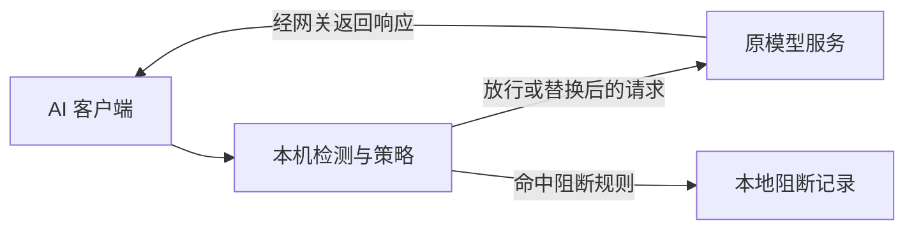

# AI Privacy Gateway

**在本机检查 AI 请求，自行决定敏感内容如何处理。**

AI Privacy Gateway 是面向 macOS 和 Windows 的开源桌面隐私网关。项目优先解决一个问题：继续使用原来的 AI 应用、登录和订阅，在请求发给模型服务前，检测并替换敏感内容。

目前已在 macOS 上验证 WorkBuddy 原登录与 Auto 模型的文本过滤，提供一键接入、规则管理和请求记录。自定义 API 与 SDK 接入作为另一种使用方式保留。

[开始使用](#开始使用) · [支持范围](#支持范围) · [路线图](#路线图) · [全局 PRD](docs/PRD.md) · [开发指南](docs/DEVELOPMENT.md)

> **当前版本：0.1.7 · M1 预览版。** 提供 macOS arm64 / x64 和 Windows x64 安装包；Windows 实机验证按本轮决定后置。完整 Agent、跨轮映射和流式还原属于 M2，语义分类暂缓。预览包未正式签名或公证，具体证据见 [M1 交付记录](docs/M1-DELIVERY.md)。

## 可以做什么

- **一键接入 WorkBuddy**：保留原登录和模型，自动配置本地代理；停止或正常退出时恢复原代理设置。
- **开箱可用的检测规则**：内置 10 条凭据规则和 4 条个人信息规则，覆盖常见密钥、Token、密码、助记词、邮箱、手机号等格式。
- **自行决定处理动作**：内置规则默认替换，每条都可改为阻断或关闭；支持新增、编辑、删除固定文本和正则规则。
- **查看真实处理记录**：展示时间、来源、命中规则、处理动作、请求结果及替换对照；无法检查的模型请求停止外发，范围外请求单独显示。
- **恢复与撤销**：崩溃后保持阻断，重新打开网关恢复；设置页可移除原生接入、系统信任及 CA 私钥，失败可重试。
- **数据留在本机**：网关的请求记录和替换映射保存在内存，退出清空；规则配置与接入恢复资料保存在本地。


*规则页示意，截图使用合成数据。*

## 工作方式



保留原订阅是产品主线。WorkBuddy 的原生接入无需另填模型 Key；选择自定义 API 时，则使用该 API 自己的认证和额度。两种接入分别验证，不能相互替代。

## 开始使用

安装包位于 [0.1.7 Release](https://github.com/yushxzh/ai-privacy-gateway/releases/tag/v0.1.7)，按系统和架构选择 DMG / ZIP 或 Windows EXE；同页提供 SHA-256 校验清单。完整包无需安装 Node.js 或 Python。安装、证书授权与卸载步骤见 [使用指南](docs/USAGE.md)。

从源码开发需要 **Git、Node.js 22.12+ 和 npm**，推荐 Node.js 24：

```bash
git clone https://github.com/yushxzh/ai-privacy-gateway.git
cd ai-privacy-gateway
npm ci
npm run prepare:native
npm run dev
```

安装与准备阶段需要联网下载 Electron 和固定版本的原生代理运行时；使用完整构建时无需另装 Python。

启动后：

1. 安装并登录 WorkBuddy，保存正在进行的任务。
2. 在网关「保护」页点击「一键开启保护」，完成首次系统证书授权；接入会重启 WorkBuddy。
3. 在 WorkBuddy 新建文本任务。网关收到并校验真实请求后，状态从「已配置 · 等待请求」变为「已验证」。
4. 在「记录」核对处理结果，在「规则」调整策略。结束时点击「停止并恢复」。

完整操作与恢复方法见 [WorkBuddy 使用指南](docs/USAGE.md)。API 用户见 [客户端接入说明](docs/INTEGRATIONS.md)；普通 API 地址为 `http://127.0.0.1:8787/v1`，WorkBuddy 原生代理使用 `http://127.0.0.1:18788`。

## 支持范围

| 接入对象 | 当前可用范围 | 验证状态 |
| --- | --- | --- |
| WorkBuddy AI 5.5.2 原登录 / Auto | 一键接入、文本检测与替换、停止及正常退出恢复 | macOS Apple Silicon 实测；付费套餐归属、完整工具循环未验收 |
| WorkBuddy 自定义 API | 按模型启用与恢复，保留已有 Key，处理文本请求 | DeepSeek 有真实验证；其他来源以本地测试为据 |
| OpenAI-compatible / Anthropic API | Chat Completions、Responses、Messages 等文本子集 | 本地 HTTP 集成测试通过 |
| Codex / Claude Code 原认证 | 实验转发入口与配置命令 | 仅模拟验证，真实订阅和完整任务待适配 |
| 其他目标客户端 | ZCode、AutoClaw、TraeWork、CodeBuddy、TraeCode、OpenCode、OpenClaw | 需求已登记，尚未完成原登录适配 |

### 使用边界

- WorkBuddy 原生入口保护 `/v2/chat/completions` 的已适配文本及元数据字段；未知模型格式停止外发。其他端点、独立上传及工具直接联网不在当前范围，不能把域名解密等同于全量过滤。
- 正文中的凭据按规则处理；客户端访问原服务所需的认证 Header 保持不变。替换后的 Token 无法用于执行依赖真实凭据的操作。
- 普通 API 的非流式 JSON 响应可恢复原值；WorkBuddy 原生和 SSE 回复仍保留代号。当前映射只在单次请求内有效。
- 检测存在误报和漏检。「已验证」表示已有请求完成检查与转发，不表示全部内容安全，也不构成长期账号风险保证。

协议细节见 [开发指南](docs/DEVELOPMENT.md)，数据边界见 [架构说明](docs/ARCHITECTURE.md)。

## 路线图

按验收条件推进，不预设发布日期。**当前交付 M1 预览包，完成情况与待人工验收项见 [M1 记录](docs/M1-DELIVERY.md)。**

| 阶段 | 主要交付 | 完成条件 | 状态 |
| --- | --- | --- | --- |
| M0 · 基础 MVP | 桌面 App、规则与记录、WorkBuddy 一键接入、MIT 开源 | macOS 限定文本路径通过验收，源码可获取 | 已完成，版本 0.1.6 |
| M1 · 可靠的双平台预览版 | 请求覆盖、异常恢复、证书撤销、界面整理及三个架构安装包 | 按声明范围验收；Windows 实机后置 | 0.1.7 交付中 |
| M2 · 原订阅 Agent 任务 | 完整工具循环、会话映射、流式恢复；优先 Codex，再推进 Claude Code | 原登录、原模型、原权益与受保护任务同时验证 | 待开发 |
| M3 · 更多客户端与检测能力 | 其余七个客户端逐项适配，扩展 PII / NER、规则更新与效果评测 | 每个客户端、每类检测都有独立验收证据 | 待开发；语义分类暂缓 |
| M4 · 高级本地与开发者能力 | 显式策略路由、加密历史、隐私报告、Embeddings、CLI / SDK / Docker | 默认数据边界不变，新增能力单独验收 | 规划中 |
| M5 · 团队与企业 | 统一策略、设备管理、权限、审计与私有部署 | 已有持续个人使用和明确团队需求 | 后置 |

完整需求按 **P0 必需、P1 核心增强、P2 扩展、P3 后置** 排列，见 [全局 PRD 的需求清单](docs/PRD.md#需求清单)。语义分类保留在 P1，按当前决定暂缓，不因已有接口而标记完成。

## 开发与验证

技术栈为 Electron、React、TypeScript；WorkBuddy 原生入口使用随包的 mitmproxy 运行时。当前代码提供 macOS arm64 / x64 与 Windows x64 的构建配置。

```bash
npm run check          # 类型、检测、HTTP 与接入逻辑检查
npm run test:desktop   # 真实 Electron 窗口交互测试
npm run pack           # 构建当前平台的应用目录
```

0.1.7 已有 147 项核心检查通过；macOS arm64 与 Rosetta 上的 x64 运行时各通过 5 项原生检查，真实 WorkBuddy 文本请求也已完成过滤。桌面、安装和系统授权的最终证据分别记录，不外推 Windows 实机或完整 Agent。复现命令见 [开发指南](docs/DEVELOPMENT.md)，完整结果见 [M1 交付记录](docs/M1-DELIVERY.md)。

## 文档与贡献

| 文档 | 内容 |
| --- | --- |
| [全局 PRD](docs/PRD.md) | 产品目标、需求等级、现状、验收标准与里程碑 |
| [使用指南](docs/USAGE.md) / [规则设置](docs/RULES.md) | 开启保护、调整规则、核对结果与恢复连接 |
| [开发指南](docs/DEVELOPMENT.md) / [架构说明](docs/ARCHITECTURE.md) | 开发、测试、构建、协议和数据边界 |
| [MVP 功能表](docs/MVP.md) / [验证记录](docs/VALIDATION.md) | 当前版本范围与历史验收证据 |

欢迎通过 [Issues](https://github.com/yushxzh/ai-privacy-gateway/issues) 或 Pull Request 提供问题复现、检测规则和客户端适配。需求讨论可引用 PRD 中的 `REQ-xxx` 编号；复现材料请使用合成数据，不公开真实 Prompt、Token、Cookie 或证书私钥。

## 许可证

源码采用 [MIT License](LICENSE)。第三方字典、公开测试向量与原生运行时的许可见 [THIRD_PARTY_LICENSES.md](THIRD_PARTY_LICENSES.md)。
