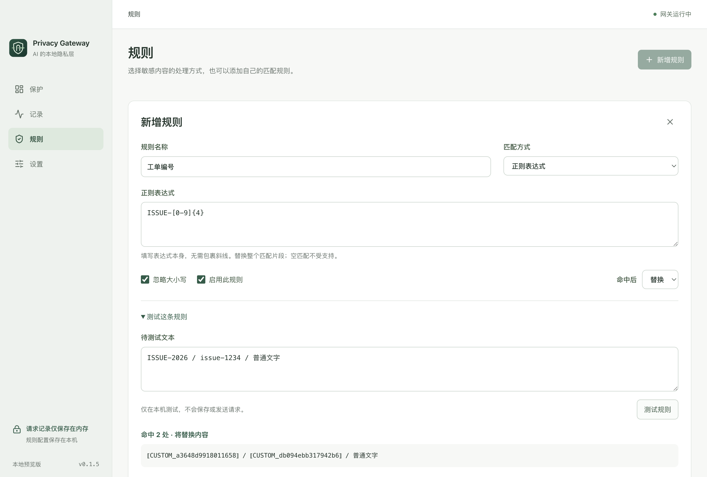

# AI Privacy Gateway

面向 Windows / macOS 的本地隐私网关桌面应用，采用 MIT 开源许可证。应用在文本请求外发前执行凭据检测、个人信息替换和策略判断，并在 GUI 中展示真实处理记录。当前版本为 0.1.6，已完成 macOS Apple Silicon 上的 WorkBuddy 一键接入与真实文本过滤验收；Windows 真机尚未验收。

当前为早期 MVP，尚不支持完整编码 Agent 任务，也未提供经过签名、公证的正式安装包。普通 API 入口默认监听 `127.0.0.1:8787` 并使用离线演示服务，无需 API Key；开启保护后的 WorkBuddy 原生入口通过 `127.0.0.1:18788` 连接原官方服务。原始请求、代号映射、记录和临时使用的上游凭据仅保存在当前应用进程内存。代理恢复资料、规则配置及本地 CA 保存在本机；自定义 API 接入另保存原服务地址、能力恢复标记与本地通行值，不另存模型 Key。

**准备使用真实订阅前，请先阅读[账号风险与十个平台接入矩阵](docs/SUBSCRIPTIONS.md)。** Codex / Claude 原认证转发仅通过模拟验证；WorkBuddy 原登录、Auto 模型的 HTTPS 文本过滤已实测，具体结果见[原生 HTTPS 验收与下一步](docs/WORKBUDDY-NATIVE-HTTPS.md)。当前仍不支持完整编码任务，也没有长期账号风险结论。

**使用先看 [WorkBuddy 一键接入指南](docs/USAGE.md)**：点击「一键开启保护」，沿用原登录和 Auto 模型；停止和正常退出时恢复原代理。规则管理见[规则设置](docs/RULES.md)，本轮验收见[0.1.6 交付与验证](docs/ITERATION-0.1.6.md)。



图示为隔离测试中的自定义规则编辑，不会向实际应用预置示例规则。

## 启动

开发环境需要 Node.js 22.12+，建议 Node.js 24。项目使用 npm，并提供依赖锁文件。Windows 和 macOS 使用相同命令：

```bash
git clone https://github.com/yushxzh/ai-privacy-gateway.git
cd ai-privacy-gateway
npm ci
npm run prepare:native
npm run dev
```

Windows 上执行同样命令。原生代理需先准备运行时；只开发普通 API 入口时可跳过 `prepare:native`。

安装依赖会下载 Electron；`prepare:native` 从 mitmproxy 官方来源下载固定版本的代理运行时并校验 SHA-256，需要联网。构建完成后无需用户安装 Python。启动 App 不会自动发送模型请求；开启 WorkBuddy 保护后，实际请求继续使用原账号及模型服务。若设置了 `ELECTRON_RUN_AS_NODE`，启动前需将其从当前终端环境中移除。

### 第一次实际使用

WorkBuddy 原登录与 Auto 模型按照[使用指南](docs/USAGE.md)接入，使用网络代理 `http://127.0.0.1:18788`，并以同一时间的真实请求记录确认效果。普通 API 的 `8787/v1` 地址不是该网络代理地址。

只有使用已保存的自定义供应商时，才使用 App「保护 → 连接一个应用 → WorkBuddy」中的按模型启用功能。该功能不管理原生 Auto 模型。

正常关闭窗口会先恢复 WorkBuddy 原代理设置并按需重启它，然后退出网关并清空记录。恢复失败会显示提示并暂缓退出；强制结束或崩溃时，需要重新打开网关或手动恢复。普通 API 端口占用时，可在「设置」选择空闲端口并应用；原生 HTTPS 端口固定为 `18788`。

在「规则」中修改内置规则的替换 / 阻断动作或启停状态；「新增规则」可保存固定文本或正则规则，支持编辑和删除。保存后普通 API 与原生 HTTPS 入口共用同一配置，重启后保留。内置规则初始动作全部为替换，详细行为见[规则设置](docs/RULES.md)。开发样例保留在测试代码中，已移出日常界面。

## 本次实现

| 能力 | 状态 |
| --- | --- |
| 中文桌面 GUI、保护、记录筛选、详情、规则、设置 | 已实现 |
| Chat Completions / Responses 文本请求 | 已实现；明确字段白名单 |
| Anthropic Messages / count_tokens 文本请求 | 已实现；保留必要协议 Header |
| 14 条内置规则，ALLOW / MASK / BLOCK | 私钥、API / 云密钥、连接凭据、密码、OAuth / JWT / JWE、助记词、邮箱、手机号、身份证、账号 |
| 编辑自定义规则时按需测试 | 使用实际匹配引擎；本地运行，不保存设置或调用模型 |
| 自定义规则新增 / 编辑 / 删除、全部规则启停与动作配置 | 已实现；本机保存、重启恢复，两类网关共用 |
| 单请求稳定代号，非流式 JSON 本地恢复 | 已实现 |
| SSE 转发 | 已实现；流式响应保留代号 |
| Codex、Claude Code、SDK 的 Bash / PowerShell 配置生成 | 已实现 |
| Codex / Claude Code 原认证转发、固定官方路由 | 已实现；真实订阅尚未联调 |
| 十个平台的原订阅条件与适配清单 | 已提供；客户端说明不等于原订阅适配完成 |
| WorkBuddy AI 5.5.2 原生 HTTPS 文本过滤 | 原登录 / Auto [已实测](docs/ITERATION-0.1.6.md)；一键接入、设置备份、重启与恢复已提供，首次需要系统证书授权 |
| WorkBuddy 自定义 API 文本过滤 | 不限制供应商与模型前缀；逐模型启用 / 恢复、来源隔离、重启恢复；内置模型不接管。真实云端验证为 DeepSeek，其余来源有本地 HTTP 验证 |
| 独立图标、固定导航、自适应页面与细滚动条 | 已实现 |
| 六类扩展接口 | 已预留 |
| macOS / Windows 打包配置 | 已配置；实际验证见验证记录 |
| 完整 Codex / Claude Code 编码任务 | 未实现；工具协议暂时拒绝 |
| 语义模型、NER、跨请求映射、加密持久化、自动路由 | 未实现 |

六类接口包括 `SecretDetector`、`PIIDetector`、`ReversiblePseudonymizer`、`PolicyEngine`、`ProviderRouter`、`SemanticClassifier`。

## 接入模型服务

WorkBuddy 使用[自定义 API 接入](docs/WORKBUDDY-CUSTOM-API.md)：先在 WorkBuddy 保存服务 URL、模型和 Key，再到「保护 → 连接一个应用 → WorkBuddy」选择模型并启用过滤。App 保留原来源和 Key，更新所选模型接口并关闭工具、图片与思考能力；每个模型可分别「恢复直连」。API 协议需兼容 OpenAI Chat Completions 文本格式。内置会员模型保持原连接。

WorkBuddy 原生模型使用[一键接入](docs/USAGE.md)，保留原客户端登录与内置模型，复用同一检测和记录模块。完整构建随附本地运行时，App 管理证书授权、应用代理和恢复。首次安装仍需完成系统证书授权。

Codex / Claude Code 提供实验性的「沿用客户端认证」模式，命令设计为保留原有登录，无需在 App 再填写 API Key。客户端负责认证与续期，网关只把请求中携带的认证头转发到对应官方地址。独立的本地通行凭据由命令自动配置，不发送给上游；真实订阅与完整客户端行为尚未验证。

OpenAI / DeepSeek SDK 使用单独配置模式：在「设置」填写地址、模型 ID 和已有 API Key。云端使用 HTTPS，本地模型可使用回环 HTTP。保存会重启网关并取消当前请求；Key 仅保存在内存，留空保存会清除。

原认证转发已通过模拟上游测试，真实订阅账户、完整工具协议和编码任务尚未联调。具体机制与边界见 [客户端接入说明](docs/INTEGRATIONS.md)。

在「保护 → 连接一个应用 → OpenAI SDK」复制环境变量后，可执行仓库中的无依赖示例：

```bash
node examples/request.mjs
```

示例只接受回环地址，避免环境变量遗漏时将演示内容发送到其他服务。使用真实云端上游时，请求会消耗该上游账户的 API 额度；SDK 示例由本地模拟上游验证；WorkBuddy 自定义 DeepSeek 的真实测试另见接入记录。

## API 范围

| 方法 | 路径 | 说明 |
| --- | --- | --- |
| GET | `/health` | 无敏感内容的健康检查，无需令牌 |
| GET | `/v1/models` | 当前配置模型，需要令牌 |
| POST | `/v1/chat/completions` | OpenAI-compatible 文本子集 |
| POST | `/v1/responses` | 文本子集；强制 `store: false` |
| POST | `/v1/messages` | Anthropic 文本子集 |
| POST | `/v1/messages/count_tokens` | Anthropic 文本计数；演示计数仅为估算 |
| POST | `/native/codex/responses` | Codex 原认证转发，需启用对应模式 |
| POST | `/native/claude/v1/messages` | Claude Code 原认证转发 |
| POST | `/native/claude/v1/messages/count_tokens` | Claude Code 原认证文本计数 |
| POST | `/workbuddy/<本地通行值>/v1/chat/completions` | 每个自定义模型的文本入口，需单独启用 |

只支持文本消息与基础生成参数。WorkBuddy 专用入口会移除已识别的工具声明与消息内部元数据；实际工具调用、工具结果、图片、音频、文件、加密内容、远端会话引用和未知字段返回 400，不将无法检查的数据直接交给上游。Embeddings 和其他路径返回 404；WebSocket 返回 501。普通 API 的 `BLOCK` 返回 403；WorkBuddy 原生 HTTPS 的内容阻断返回 422，未认证返回 401，请求超过 256 KiB 返回 413，并发超过 4 返回 429。

网关不是全局系统代理。仅修改应用的 API 地址不会自动覆盖它的遥测、插件或其他网络请求。

## 验证与构建

```bash
npm run check          # 类型检查与本地 HTTP / 检测测试
npm run test:desktop   # 构建并启动真实 Electron 窗口测试
npm run build          # 编译到 out/
npm start              # 启动编译后的应用
npm run pack           # 生成当前平台的应用目录
npm run dist:mac       # macOS: DMG / ZIP
npm run dist:win       # Windows: NSIS 安装包
```

平台安装包应在对应操作系统上构建。当前没有配置发布凭据；未签名 / 未公证安装包不等于可公开分发的正式版本。最新验收见 [0.1.6 验证记录](docs/ITERATION-0.1.6.md)，历史结果见 [验证记录](docs/VALIDATION.md)。

原生代理测试另外需要安装了 `mitmproxy==12.2.3` 的 Python 3.12+ 环境。macOS / Linux 终端可在项目内创建隔离测试环境；Linux 仅运行此测试，不代表桌面应用支持 Linux：

```bash
python3 -m venv work/test-python
work/test-python/bin/python -m pip install mitmproxy==12.2.3
APG_TEST_PYTHON="$PWD/work/test-python/bin/python" npm run test:native
```

Windows PowerShell 对应命令：

```powershell
py -3.12 -m venv work/test-python
./work/test-python/Scripts/python.exe -m pip install mitmproxy==12.2.3
$env:APG_TEST_PYTHON = (Resolve-Path ./work/test-python/Scripts/python.exe).Path
npm run test:native
```

`APG_TEST_MITMDUMP` 可指定待验证的独立 `mitmdump` 可执行文件；未设置时使用上述 Python 环境中的程序。测试使用临时证书和本地请求，不导入系统证书、不读取真实登录配置。

## 目录

```text
src/
  main/          Electron 生命周期与 IPC
  preload/       受限桌面桥
  renderer/      React 界面
  gateway/       HTTP、协议校验、记录、Provider
  https/         WorkBuddy 原生 HTTPS 正文检查适配
  privacy/       检测、策略、映射和六类扩展契约
  shared/        类型与接入命令生成
resources/       原创 SVG 图标、PNG、macOS ICNS 与 Windows ICO
tests/           检测、HTTP 集成、桌面交互测试
examples/        本地请求示例
docs/            功能表、架构图、接入说明、验证记录
```

- [MVP 功能表](docs/MVP.md)
- [WorkBuddy 使用指南：开启、验证、重启与恢复](docs/USAGE.md)
- [产品问题梳理：页面、按钮、规则与下一轮验收](docs/PRODUCT-REVIEW.md)
- [架构与数据边界](docs/ARCHITECTURE.md)
- [客户端接入说明](docs/INTEGRATIONS.md)
- [实际验证记录](docs/VALIDATION.md)
- [规则动作与自定义规则](docs/RULES.md)
- [0.1.5 交付与验证](docs/ITERATION-0.1.5.md)
- [0.1.6 一键接入交付与验证](docs/ITERATION-0.1.6.md)
- [WorkBuddy 自定义 API 接入](docs/WORKBUDDY-CUSTOM-API.md)
- [WorkBuddy 原生 HTTPS 验收与下一步](docs/WORKBUDDY-NATIVE-HTTPS.md)

## 隐私与检测边界

本网关将规则定义与动作配置保存在本机，不持久保存 Prompt、规则验证输入、映射或请求记录，不配置遥测或云端审计服务，不另存上游 Key。WorkBuddy 原生一键接入只修改代理字段；自定义 API 接入才更新对应模型的接口配置并保留已有 Key。WorkBuddy 自身的聊天历史与日志不由本网关管理。记录最多 100 条、总容量最多 8 MiB；原文与替换预览各最多 24,000 个字符，超长内容保留开头和结尾。操作系统可能使用交换内存或崩溃转储，当前不提供取证级擦除保证。

当前有 14 条有限规则，覆盖的具体格式与设置方式见[规则目录](docs/RULES.md)。BIP39 使用随应用提供的十种字典与校验，无运行时下载。人名、地址、业务机密、混淆编码、跨文本块拆分的敏感信息尚未完整覆盖。未命中规则只表示未被当前实现识别，不代表内容不敏感。

## 许可证

项目源码采用 [MIT License](LICENSE)。第三方字典、公开测试向量和原生运行时的许可见 [THIRD_PARTY_LICENSES.md](THIRD_PARTY_LICENSES.md)。`package.json` 中的 `private: true` 仅用于防止误发布到 npm，不影响源码开源。
