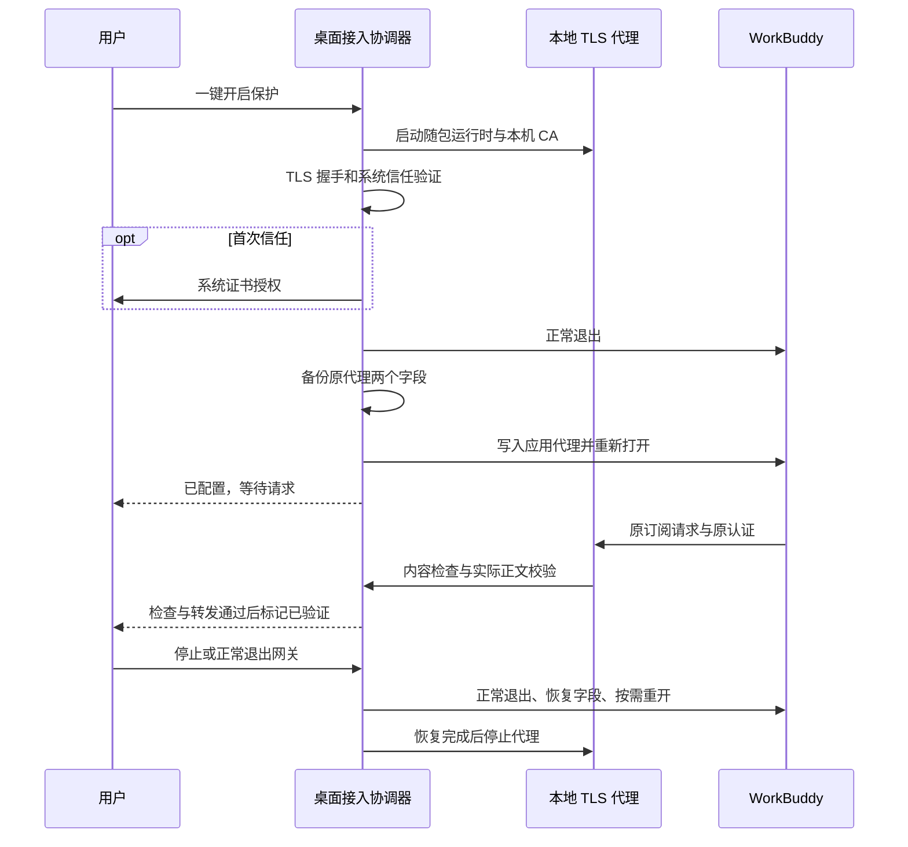
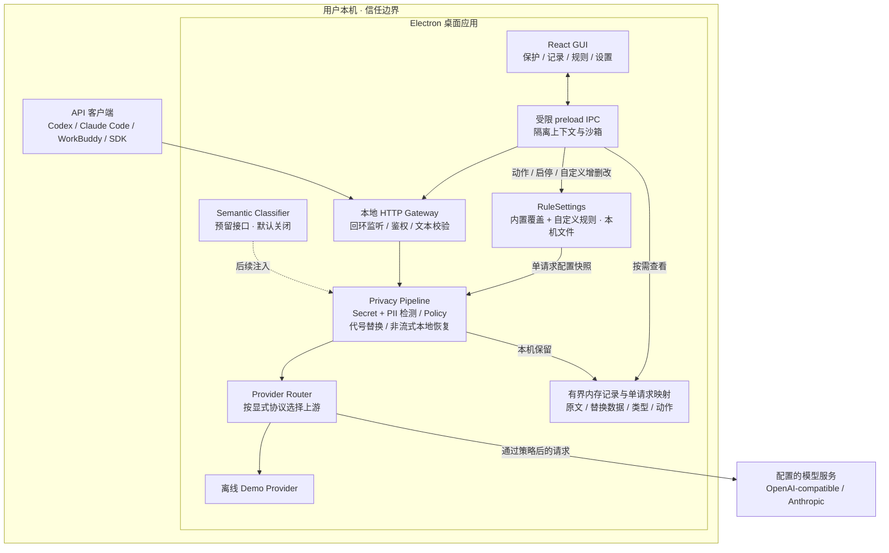
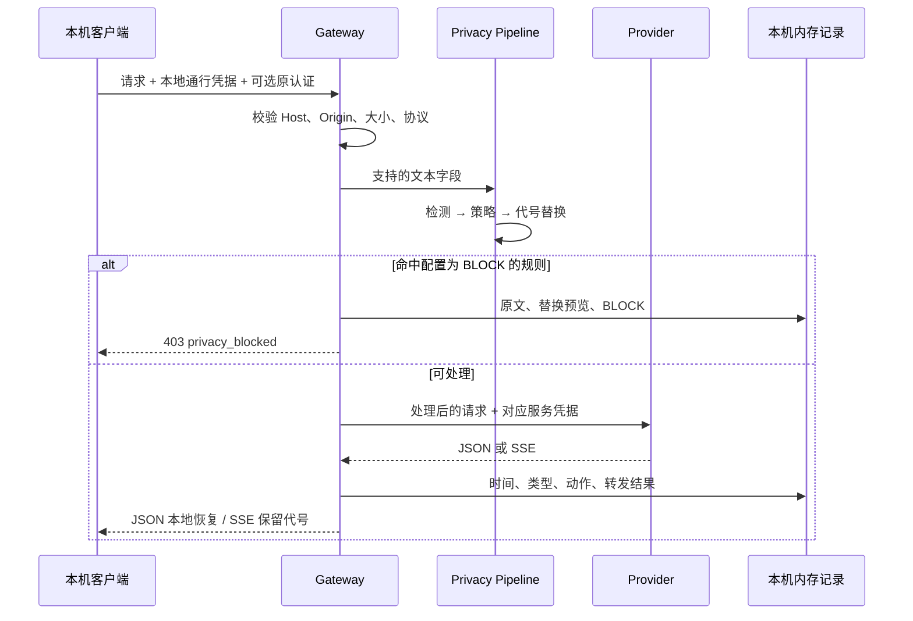
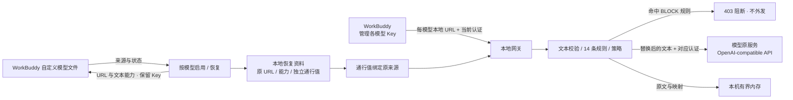
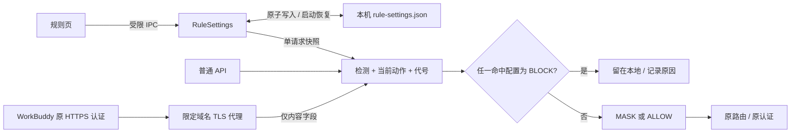

# 架构与隐私边界

## 技术选型

采用 Electron + React + TypeScript + electron-vite；本地 HTTP 服务使用 Node.js 内置模块，安装构建使用 electron-builder。普通 API 入口无额外 Python / Rust 运行时或本地数据库依赖；WorkBuddy 原生 HTTPS 入口随完整安装包提供 mitmproxy 12.2.3 独立运行时，不要求用户安装 Python。Electron 的安装体积和空闲内存高于 Tauri；当前优先开发效率、跨平台一致性和较少的工具链。

## 组件图

0.1.7 的 WorkBuddy 原生连接由桌面接入协调器管理。开启和恢复的顺序如下：

协调器只覆盖 `~/.workbuddy-ai/settings.json` 中的 `http.proxy`、`http.proxySupport`，备份不包含 WorkBuddy 登录 Token；恢复时保留后来修改的其他字段。接入期间改成另一代理时，不覆盖新代理。证书目录及恢复资料保存在网关用户数据目录下。

接入操作串行执行。客户端未退出时不强杀，恢复失败保留代理与备份；代理意外结束或外部修改代理配置时，撤销「已验证」。TLS 子进程在检查入口连续失联后自行退出。崩溃后保持阻断，不自动直连或自动重启网关；下一次打开网关根据备份恢复同一端口，等待新请求重新验证。

完全移除时先关闭客户端、恢复配置和停止代理，再按公钥证书的 SHA-256 撤销当前用户信任，删除 CA 私钥并重开客户端。公钥撤销身份独立保存在 `native-https/certificate.json`，系统授权失败时保留身份和私钥供重试。Windows 真正卸载会先恢复全部受管理模型地址；清理失败保留应用，更新安装不清理接入。

macOS 按 `.app/Contents/MacOS/Electron` 的实际路径判断 WorkBuddy 是否退出，不能假设进程名等于展示名称。Windows 使用 PowerShell 读取进程及安装路径，通过正常关闭窗口请求退出；托盘及退出行为仍需 Windows 真机验收。

[查看可缩放架构图](assets/architecture.svg)。请求与响应的具体顺序见下一节。

## 一次请求

[查看可缩放时序图](assets/request-flow.svg)。

## 进程与模块

| 目录 | 职责 |
| --- | --- |
| `src/main` | Electron 生命周期、IPC、安全设置 |
| `src/gateway` | 本地 HTTP 服务、请求校验、Provider 与响应处理 |
| `src/privacy` | 六类扩展接口、基础规则、策略、单请求映射 |
| `src/shared` | IPC 数据类型、接入命令、14 条规则的共享目录与样例 |
| `src/preload` | 最小权限桥，不暴露任意 IPC、文件或执行命令能力 |
| `src/renderer` | 本地资源组成的 React 界面 |
| `tests` | 检测及网关行为测试、Electron 启动测试 |
| `docs` | 功能表、架构、接入与验证记录 |

当前网关运行于 Electron 主进程。规则仅处理有大小上限的文本；并发设限。Semantic Classifier 接入较大本地模型时，应移至 Worker / utility process，避免阻塞桌面界面。

## 六类扩展契约

`src/privacy/contracts.ts` 定义 `SecretDetector`、`PIIDetector`、`ReversiblePseudonymizer`、`PolicyEngine`、`SemanticClassifier`、`ProviderRouter`。默认实现直接组合，不引入插件注册框架。`ROUTE` 与语义模型仅保留契约；当前不根据语义自动切换模型。

代号使用随机请求密钥计算 HMAC，同一请求内相同实体使用相同代号；不同请求之间不关联。不持久化密钥或映射。只恢复当前请求产生的完整代号，避免一个客户端通过猜测代号访问其他请求的原文。

## 数据和访问边界

- 仅监听 IPv4 回环地址；通用入口令牌每次启动重新生成，WorkBuddy 每模型通行值随接入资料保存在本机；健康检查不包含凭据和记录。
- 校验 Host，拒绝带 Origin 的浏览器请求，不开放 CORS。管理界面通过受限 IPC 访问，不通过 HTTP 暴露管理端点。
- 本地通行凭据不发送给上游。SDK 模式使用 App 中配置的 Key；原认证模式保留客户端认证头，固定转发到所属官方服务，忽略可配置上游 URL。Anthropic 协议头完整保留；Header 不写入记录。
- SDK 配置模式的云端上游必须 HTTPS，HTTP 仅允许显式回环地址。WorkBuddy 保留用户已配置的 HTTP / HTTPS 来源和非凭据查询参数，支持本地或内网模型；禁止 URL 内认证、凭据查询参数、跳转及指向本网关的递归配置。
- 请求校验失败时明确拒绝，不把未检查的图片、文件、加密内容当作普通文本。超时、取消和响应大小均受限；上游异常不在客户端错误或控制台中回显原文、凭据或原始异常内容。
- 记录、原始 Prompt、替换映射和上游 Key 仅保存在应用内存。默认无文件日志、遥测或云端数据库。应用框架和操作系统可能存在系统缓存、交换内存或崩溃转储；当前不承诺取证级擦除。
- 渲染器禁止 Node 集成，启用上下文隔离和沙箱，限制导航、窗口创建与权限请求。记录文本作为 React 文本节点展示，不解释为 HTML。
- 本机恶意软件或同一系统账户的高权限进程不在本项目防护范围内。只保护实际经过本地端口的请求，不接管系统网络。

## 协议约定

提供 `/health`、`/v1/models`、`/v1/chat/completions`、`/v1/responses`、`/v1/messages`、`/v1/messages/count_tokens`。模型列表来自当前设置，不向远端拉取。Responses 强制 `store: false`，禁止后台请求、远端会话引用与云端工具。Embeddings 和 WebSocket 暂不实现，返回明确错误。

Chat、Responses、Messages 只处理文本消息，首版拒绝工具定义和调用、多模态内容。保留有限生成参数白名单。非流式响应递归恢复 JSON 字符串中的当前请求代号；流式响应按上游 SSE 字节转发并保留代号。完整 Agent 支持需要协议级适配和专门回归，不能由「返回 200」推断。

## 构建与官方依据

依赖版本以 `package-lock.json` 为准。macOS DMG / ZIP 和 Windows NSIS 应在对应平台构建与验证；签名、公证和发布凭据不写入仓库。

- [Electron 安全建议](https://www.electronjs.org/docs/latest/tutorial/security)
- [electron-vite 开发结构](https://electron-vite.org/guide/dev)
- [Codex 自定义 Provider](https://developers.openai.com/codex/config-advanced/)
- [Claude Code Gateway 协议](https://code.claude.com/docs/en/llm-gateway-protocol)
- [DeepSeek API](https://api-docs.deepseek.com/)

上述官方资料于 2026-09-11 核对。能力边界以本项目测试和实现为准。

## 原认证转发边界

`src/gateway/client-auth.ts` 负责原认证路由，与 SDK 的 `ConfiguredProviderRouter` 分开。原认证入口在离线模式关闭，只有显式启用 `client` 模式后接受调用。所有入口先验证 Host、Origin 和独立本地通行 Header，再进行正文检测。

| 入口 | 上游目标 | 认证来源 |
| --- | --- | --- |
| `/native/codex/responses`，存在 ChatGPT 账户头 | `https://chatgpt.com/backend-api/codex/responses` | 当前请求 Bearer 与账户头 |
| `/native/codex/responses`，其余 Bearer | `https://api.openai.com/v1/responses` | 当前请求 Bearer |
| `/native/claude/v1/messages` 及 count_tokens | `https://api.anthropic.com` | 当前请求 Authorization / x-api-key |

客户端自身负责登录、刷新与注销。网关不读取凭据文件，不持久保存或展示认证 Header，不跟随重定向。固定路由目前未适配企业专用地区及非 Bearer 认证，不等于完整 Agent 兼容。

## WorkBuddy 按自定义模型接入

[查看可缩放自定义 API 路由图](assets/workbuddy-flow.svg)。

`src/main/workbuddy-config.ts` 读取本机 `~/.workbuddy-ai/models.json`，兼容顶层数组与 `{ models: [...] }`。只处理自定义模型文件中的唯一模型 ID 与 HTTP / HTTPS 来源，不限制供应商、模型前缀；显式内置条目排除。WorkBuddy 内置登录与模型设置不读取、不修改。渲染器仅收到模型 ID、名称、来源和连接状态，不含 `apiKey`。

每个模型分别保存原 URL、原能力标记与 256 位随机 URL 通行值到应用数据目录的 `workbuddy-connections.json`。不保存模型 Key、请求正文或映射。文件用临时文件加原子替换写入，在 POSIX 系统申请 `0600`；修改 WorkBuddy 文件前核对是否发生外部编辑。恢复信息先落盘，随后仅修改所选模型 URL 与文本能力标记。恢复直连保留期间由用户修改的其他字段。接入状态在 App 重启时恢复；每秒检查自定义配置文件变更，删除或更改来源后撤销旧入口，不把旧连接自动转到新来源。

`src/gateway/workbuddy.ts` 保留当前请求中的 Bearer、`x-api-key` 或 `api-key`；无认证的本地服务可不带 Key。转发来源来自本机保存的绑定，不接受请求体或 Header 指定目的地，不跟随跳转；本地通行值不外发、不出现在记录路径。多个来源分别控制；撤销一个模型只取消对应的在途请求。

协议仍是 Chat Completions 文本子集。关闭 WorkBuddy「自定义协议」时，按其约定补齐 `/chat/completions`；开启时使用原完整 URL。移除 `tools`、`tool_choice`、`parallel_tool_calls` 和已知消息内部元数据，实际工具调用、工具结果、图片、开启思考及未知字段拒绝。只对 DeepSeek 官方入口附加 `thinking: { type: "disabled" }`，不污染其他供应商请求。SSE 保留代号，非流式 JSON 可在本机恢复。

记录展示经过字段清理、检测前的文本请求与检测后的替换预览，记录来源主机便于区分自定义服务。长记录保留开头和结尾，每侧最多 24,000 字符；记录截断不影响完整请求检测。

## 规则配置与两类入口

`src/shared/rules.ts` 保存 14 条内置规则的稳定 ID、描述、检测器和开发测试样例。`RuleSettings` 另存内置规则的启停 / 动作覆盖和自定义规则；初始均启用并使用 `MASK`。主进程创建一个实例，普通 `PrivacyGateway` 与 `NativeInspection` 共用。

每次处理固定规则配置快照，记录保存命中规则名称、来源、动作及配置版本；保存新设置只影响后续请求。动作判定使用全部命中，避免重叠替换覆盖短阻断命中。自定义重叠片段取覆盖并集；内置规则保留既有的确定性优先级。

用户规则仅支持固定文本和正则参数，不接收可执行脚本。固定匹配程序使用 Node `vm.Script` 的 100 ms 执行超时，另设 2,000 处命中上限；空匹配拒绝。这里不把 `vm` 当成运行任意用户 JavaScript 的安全边界。依据：[Node vm 文档](https://nodejs.org/api/vm.html)。

规则文件通过同目录临时文件和原子替换保存，POSIX 权限为 `0600`。成功写入后才更新有效配置；修订号避免旧编辑覆盖新设置。损坏的配置导致检查暂停并提示错误，不退回会丢失阻断策略的默认设置。

自定义规则的编辑测试使用独立内存流水线，只检查未保存的单条规则，不影响运行配置、不调用 Provider、不写请求记录。内置正反例留在测试中。普通 API 主动内容阻断返回 HTTP 403；WorkBuddy 原生代理返回 HTTP 422。实际认证 Header 不参与正文扫描或改写，也不写入记录；原生发送前校验命中原文已移除、认证保持不变。

BIP39 字典直接打包到应用，十种语言、12 / 15 / 18 / 21 / 24 词，使用 NFKD 与 SHA-256 校验。另有明确助记词字段规则覆盖抄写错误或未知词表。字典及测试向量来源见 [BIP39 说明](BIP39-WORDLISTS.md)，覆盖边界见 [规则目录](RULES.md)。

## 桌面外观资源

`resources/icon.svg` 为盾牌与通道构成的原创几何标识，PNG 用于窗口与开发态 Dock，ICNS / ICO 分别用于 macOS / Windows 安装包。`styles.css` 与 `tokens.css` 统一色彩、字体、焦点、表单和滚动条；窗口主体不滚动，页面内容、命令区和详情正文按需独立滚动。

标题栏使用 Electron 的 `titleBarStyle: hidden` 与页面融合：macOS 原生按钮位于左上方，Windows 通过 `titleBarOverlay` 保留系统窗口按钮。顶栏设置可拖动区域，交互控件使用 `no-drag`。[Electron 标题栏文档](https://www.electronjs.org/docs/latest/tutorial/custom-title-bar)
