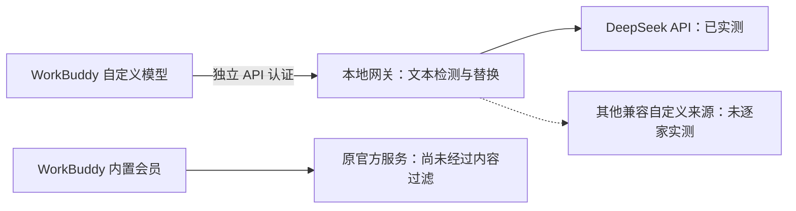
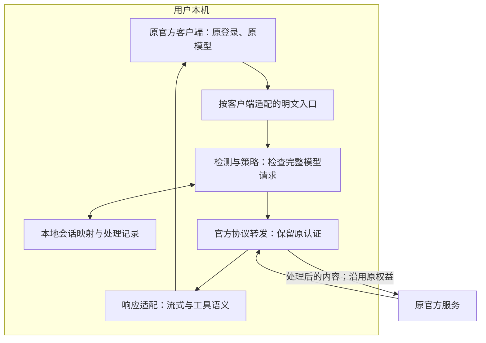

# AI Privacy Gateway：需求回溯、实现差距与路线图

> 0.1.6 已补齐 WorkBuddy 一键接入、原代理备份、重启和正常退出恢复，见 [本轮验收](ITERATION-0.1.6.md)。本轮按用户决定暂缓语义模型；Windows 真机尚未接入。

> 本文保留当时的分析快照。0.1.5 已完成默认替换、逐规则动作 / 启停、自定义规则、本地保存和部分页面精简；最新事实与剩余缺口见 [0.1.5 交付与验证](ITERATION-0.1.5.md)。历史建议中的「凭据默认阻断」已按用户要求调整。

审计日期：2026-09-12 · 当前源码：0.1.4 · 状态：路线建议，尚未实施

> 后续进展：本文件保留路线纠偏时的审计快照。此后已完成 WorkBuddy 原登录、Auto 模型的原生 HTTPS 文本过滤实测；新的验收结果、剩余限制与下一阶段目标见 [WorkBuddy 原生 HTTPS 验收与下一步](WORKBUDDY-NATIVE-HTTPS.md)。下文「尚未过滤」属于该次审计时点，不代表最新实验状态。

本报告核对最初头脑风暴、后续用户要求、当前源码与已有验证记录。本轮只读检查并编写文档，未修改应用、客户端配置或认证，未发起真实订阅请求。历史测试结果均注明范围，不作为本轮重新测试的结果。

## 1. 核心判断

**当前做出了可运行的本地 API 文本过滤原型，但还没有交付面向原生会员用户的隐私产品。**

产品主场景应当是：继续使用原来的官方客户端、账号、订阅、模型和额度，在完整模型请求离开本机之前处理敏感内容。要求另配一套 API Key、改用其他供应商或承担另一份费用，会排除希望继续消费原会员权益的用户。这个覆盖缺口成立；目前没有用户研究数据可以量化损失比例。

需要同时澄清：现有 Codex / Claude Code 实验入口本来就试图保留原认证，并非只能转接 DeepSeek。问题在于它们只经过模拟上游验证，且当前协议不支持完整编程任务。WorkBuddy 真正验证成功的是自定义 DeepSeek 文本路径；WorkBuddy 内置会员仍未实现内容过滤。

当前工作的价值与缺口如下：

| 已形成的基础 | 尚未达成的核心目标 |
| --- | --- |
| 本地 GUI、端口、检测流水线、14 条规则、原文与替换记录 | 官方客户端沿用原会员，完成可用的受保护任务 |
| WorkBuddy 自定义 API 按模型接入、恢复与真实文本过滤 | WorkBuddy 内置会员的完整明文接入 |
| Codex / Claude Code 原认证转发实验 | 真实订阅、原模型与原额度归属验证 |
| 单请求替换、非流式恢复、基础转发 | 工具循环、跨轮映射、流式恢复、上下文续接 |
| macOS 开发构建及测试材料 | Windows / macOS 可分发、可持续使用的开源产品 |

**路线建议：保留现有 GUI 和隐私核心，把「原会员完整任务」提到首位；自定义 API 保留为第二条入口。** 暂缓通过增加平台卡片、供应商名称和更多规则来扩大「支持数量」。

## 2. 需求是如何形成的

需求来源分为「用户明确要求」「讨论中提出并总体认可」「首轮骨架暂缓」「明确后置」。不能把所有头脑风暴都算作首版承诺，也不能把首轮骨架的缩小范围当作长期删减。

| 来源 | 当时的主要内容 | 本次审计的解释 |
| --- | --- | --- |
| S1：最初产品设想 | 在本地过滤敏感信息，再发给国内外云模型；讨论小模型的作用 | 核心价值是本地保护。训练 2.7B 模型是方案假设，后来建议改为规则、NER 与可选语义分类，并非必须自训练 |
| S2：开源获客路线 | 先免费开源吸引个人用户，再由团队治理需求带来企业收入 | 开源和个人日常使用是主线；公开许可、发布与留存验证仍在待办中 |
| S3：详细 MVP 讨论 | Local Gateway、Secret、PII、可逆替换、Policy、Provider Router、Dashboard、CLI 八个模块；提出会话映射、可改策略、本地路由等 | 这些是完整需求池，后来「预留接口」只满足骨架阶段，不等于功能完成 |
| S4：GUI 与初始化请求 | Windows / macOS 安装即用、本地端口、接入说明或命令、原文与替换记录、六类接口、README 与架构文档 | 这轮明确要求最小可运行骨架，因此首轮收缩合理；双平台实际安装验收仍需补齐 |
| S5：认证与使用体验修正 | 沿用 Codex / Claude Code 原认证；不能承诺的 Cursor 去掉；更换图标、优化页面、滚动条与标题栏 | 原认证不是本轮才出现的新需求；Cursor 是主动取消，并非遗漏 |
| S6：十个平台与订阅优先 | 明确「优先沿用各平台原有订阅或登录」；确认准备测试 ChatGPT 订阅；先试本机 WorkBuddy | 客户端、原订阅、实际请求覆盖必须同时验收；接入说明不能算适配完成 |
| S7：WorkBuddy 自定义 API 试验 | 只有已配置自定义模型才启用；先用 DeepSeek，后扩展自定义来源；Key 留在 WorkBuddy；全部规则可点、可验证 | 这是获准执行的阶段试验，没有取消 S6 的原会员目标。0.1.4 的实测成果属于此阶段 |
| S8：本次路线纠偏 | 指出自定义 API 不能覆盖客户端原生会员的主场景 | 将原会员覆盖恢复为首要验收条件，重新分配后续工作 |

S1–S4 来自早期产品讨论「隐私网关产品头脑风暴」及项目初始化要求；S5–S8 来自后续需求讨论。原讨论中的市场规模、竞品数值、转化率和性能目标，本报告未重新核实，不作为当前事实引用；私人对话链接不随源码公开。

## 3. 先区分三种使用路径

「API」是通信接口，「订阅」是认证和权益关系。客户端的原生会员调用也要通过网络接口。真正的问题是：网关接入后，是否保留原身份、原模型、原额度和原工作方式。

| 路径 | 用户已有权益 | 应当如何接入 | 当前项目状态 |
| --- | --- | --- | --- |
| A：官方客户端原生会员 | 例如本人 ChatGPT 订阅中的 Codex 使用权益、WorkBuddy 内置会员 | 客户端继续管理登录与续期；本地网关过滤后转回该账号对应的官方服务 | **核心目标未验收**。Codex / Claude 有实验入口；WorkBuddy 内置未过滤 |
| B：客户端接第三方 Coding Plan | 用户另有服务商发放的套餐凭据或订阅入口 | 按该套餐允许的客户端、认证和端点接入 | 不能由通用兼容接口推定全部支持，需按套餐核验 |
| C：自备按量 API / 本地模型 | API Key、账户余额，或本地推理服务 | OpenAI-compatible / Anthropic 等明确协议接入 | 部分实现；WorkBuddy → DeepSeek 文本有真实验证，其他来源未逐家实测 |

WorkBuddy 使用自定义 DeepSeek，消费的是所配置 DeepSeek 服务的认证与额度，不会因为外层仍是 WorkBuddy，就变成使用 WorkBuddy 内置会员。

但「自定义 Provider」也不能一概归入 B / C。Codex 官方说明 `requires_openai_auth=true` 可继续使用 ChatGPT 登录，并明确列出通过 LLM proxy 访问的用途。Claude Code 官方也说明，仅修改网关地址、未启用替代认证时，可继续使用原 claude.ai 登录。它们为 A 提供了可研究的官方入口；具体产品兼容与许可仍需分别核验。[Codex 认证](https://learn.chatgpt.com/docs/auth)、[Claude 订阅与网关](https://code.claude.com/docs/en/llm-gateway#subscriptions-and-gateways)

### 当前已验证的路径

### 目标路径

这是目标设计，不表示上述节点已实现。命中的敏感原文与映射留在本机；认证只用于既定官方目的地，登录和续期仍由原客户端管理。完整请求包括用户输入、客户端附加的上下文、文件内容、工具定义与工具结果。只过滤输入框文本不能覆盖整个 Agent 工作流。

原生订阅适配与独立 API 适配可以共用现有检测核心。需要补齐的是客户端协议、明文入口与会话处理，并不需要为了纠偏立即更换 Electron、重写全部检测器或增加通用中间层。

## 4. 功能清单：原计划、当前实现与缺口

状态统一使用：**已实现**＝限定范围有实现和已有验证；**部分实现**＝只满足部分要求；**仅预留**＝接口或说明存在；**未实现**＝需求仍在；**明确后置 / 已取消**＝不应算作首发漏项。下表不计算总完成率，避免把接口占位、GUI 页面和完整客户端适配等权相加。

### 4.1 产品形态与接入

| 编号 | 原始或后续需求 | 当前状态与证据 | 尚缺内容 / 建议去向 |
| --- | --- | --- | --- |
| F01 | Windows / macOS 本地 GUI，安装即用（S4） | **部分实现**。Electron + React + TypeScript；macOS arm64 应用曾真实启动；Windows 有 NSIS 配置 | Windows 真机、macOS Intel、全新机器安装、权限与卸载验证；进入首发门槛 |
| F02 | 启动即开放本地端口（S4） | **已实现**。默认 `127.0.0.1:8787`；启停、冲突提示、退出释放 | 保留；与客户端断开、恢复行为联动验收 |
| F03 | OpenAI-compatible Gateway（S3 / S4） | **部分实现**。Chat Completions、Responses 文本子集，JSON / SSE 转发 | 工具、状态、推理等完整客户端协议；不能以两条路径存在就称完全兼容 |
| F04 | Embeddings 接口（S3） | **未实现**。当前路由未提供 `/v1/embeddings` | 纳入明确待办；建议排在原会员编码主路径之后 |
| F05 | Claude / DeepSeek / 通用上游（S3） | **部分实现**。Anthropic 原生文本接口、DeepSeek Chat、兼容上游；不做协议互转 | Provider 特有字段、完整任务验证；Gemini 原生协议没有适配 |
| F06 | Codex / Claude 沿用原认证（S5 / S6） | **部分实现**。独立原认证路由、临时命令与模拟测试；无需在网关再填平台 Key | 原订阅真实任务、认证续期、模型与额度归属；最高优先级 |
| F07 | WorkBuddy 原会员过滤（S6 / S8） | **未实现**。只有原登录下 CONNECT 连通证据，TLS 正文未被检查 | 找到可修改完整明文请求的入口；通过后才可进入适配 |
| F08 | WorkBuddy 自定义 API（S7） | **已实现，限文本子集**。按模型启用、恢复直连、重启恢复；真实 DeepSeek 文本替换与阻断 | 不代表内置会员支持；其他商业来源、工具等仍待验证 |
| F09 | 十个目标客户端（S6） | **部分实现**。全部有状态或说明；真实覆盖远少于清单数量 | 按第 5 节逐客户端、逐形态验收 |
| F10 | 接入说明、一键命令 / 环境变量（S4） | **部分实现**。Codex / Claude 实验命令，SDK 示例，WorkBuddy 按模型配置 | 安装发现、配置预检、原订阅识别、明确的受保护状态与恢复验证 |
| F11 | 自有图标、页面、滚动条、顶部黑条优化（S5） | **已实现**。已有新版图标、统一样式、融合标题栏和交互截图 | Windows 原生窗口与图标仍需真机确认；不再作为主线阻塞 |

### 4.2 检测能力

| 编号 | 原始或后续需求 | 当前状态与证据 | 尚缺内容 / 建议去向 |
| --- | --- | --- | --- |
| F12 | Secret Detection（S3） | **部分实现**。10 条规则：私钥、API / 云密钥、含凭据连接地址、密码、OAuth、JWT / JWE、助记词等 | 格式与上下文有限；没有证明覆盖所有密钥。扩充应依据独立漏检 / 误报样本 |
| F13 | PII 基础规则（S3） | **部分实现**。邮箱、大陆手机号、身份证格式、显式账号字段共 4 条 | 身份证格式识别不等于真实性校验；继续保留边界说明 |
| F14 | 姓名、地址、企业名称、银行卡、IP 等（S3） | **未实现**。当前 4 条个人信息规则不覆盖完整原清单 | 先补明确格式与校验，再评测本地 NER；不能把「PII 模块存在」写成全部完成 |
| F15 | 本地 NER / 实体识别（S1 / S3） | **未实现** | 用独立中文 / 英文数据验证召回、误报、资源消耗；根据结果选模型 |
| F16 | 商业敏感内容与语义分类（S1 / S3） | **仅预留**。`DisabledSemanticClassifier` 关闭且返回空结果 | 客户报价、财务、项目代号、商业计划等未获语义保护；先有标注样本，再做实验实现 |
| F17 | 本地小模型推理（S1 / S3） | **未实现**。当前不运行分类模型 | 2.7B、自训练、特定推理框架都不是必须补回的交付；效果与性能决定选型 |
| F18 | 所有规则可查看、单条 / 自定义 / 批量验证（S7） | **已实现**。14 条规则、63 个正反例；助记词另有 260 条独立向量 | 保留；这些用例不能替代实际语料上的检测效果报告 |
| F19 | 漏检、误报、延迟、资源与任务质量评测（S1 / S3） | **部分实现**。已有正确性用例与验证记录 | 缺独立评测集、准确性报告、性能基线和脱敏前后任务成功率；首发前补齐 |

### 4.3 可逆替换、策略与路由

| 编号 | 原始或后续需求 | 当前状态与证据 | 尚缺内容 / 建议去向 |
| --- | --- | --- | --- |
| F20 | 替换并在响应恢复原值（S3） | **部分实现**。单请求内代号稳定，非流式 JSON 可恢复 | 目前不代表完整客户端可逆替换 |
| F21 | 同会话实体代号跨轮稳定（S3） | **未实现**。每次请求新建映射，请求结束清除 | 明确会话标识、隔离、生命周期；解决历史消息与新工具结果中的同一实体 |
| F22 | 流式响应恢复（S3 的可逆目标） | **未实现**。SSE 可转发，但回复保留代号 | 跨分片恢复、取消、部分响应、协议事件一致性；升级为原生任务必要条件 |
| F23 | 工具调用、文件路径与本地执行不被替换破坏（S6 / S8） | **未实现**。真实工具调用 / 结果被拒绝；WorkBuddy 接入会关闭工具等能力标记 | 完整循环与字段级处理。关闭工具只得到文本演示，不能验收编码 Agent |
| F24 | Local Entity Vault / 加密映射（S3） | **部分实现**。只有短生命周期内存映射，没有会话 Vault | 会话内存映射先实现；可选持久化需系统密钥库、保留期与删除机制 |
| F25 | ALLOW / MASK / BLOCK / ROUTE（S3） | **部分实现**。固定策略：凭据 BLOCK、PII MASK、其余 ALLOW | ROUTE 仅类型存在；未形成可配置四动作策略 |
| F26 | 用户直接修改 YAML / 策略（S3） | **未实现**。规则试验输入不等于规则编辑 | 自定义规则、动作、例外、优先级、导入校验；建议先做必要的本地策略配置 |
| F27 | 高风险内容转本地 / 私有模型（S3） | **未实现**。自动 ROUTE 分支返回未实现错误 | 手工填写本地上游不等于按风险路由。建议原会员主路径稳定后单独做，并明确模型 / 计费变化 |
| F28 | 多供应商与本地模型选择（S3） | **部分实现**。静态上游配置、兼容本地地址；WorkBuddy 按模型绑定来源 | 不是所有供应商协议、Ollama / vLLM 实例均已实测；缺自动路由验收 |
| F29 | 六类可替换接口（S4） | **已实现接口层**。Secret、PII、Reversible、Policy、Provider Router、Semantic 均有契约 | 此项只验收扩展边界；不能据此给 F12–F28 全部打勾 |

### 4.4 记录、本地数据与分发

| 编号 | 原始或后续需求 | 当前状态与证据 | 尚缺内容 / 建议去向 |
| --- | --- | --- | --- |
| F30 | 原文 / 替换后内容、时间、判断类型、动作（S4） | **已实现，限有界内存记录**。真实请求生成，可按需显示原文；另有状态、模型、接口 | 原文与替换预览各最多 24,000 字符，长内容截断，不能宣称保存完整请求档案 |
| F31 | 判断依据与可追溯性（S3 / S4） | **部分实现**。记录保存类别与命中数量；规则试验页展示命中规则 | 请求记录未保存逐项规则 ID / 命中位置与完整决策链；处理失败的覆盖说明也需补齐 |
| F32 | Dashboard 统计与 Privacy Report（S2 / S3） | **部分实现**。本次启动的总数、替换、阻断、放行 | 缺跨日历史、按供应商趋势、周期隐私报告；本次启动统计不能叫日活或月度保护量 |
| F33 | 原始 Prompt / 映射默认只在本地（S1 / S4） | **已实现当前存储边界**。网关记录与映射在本机内存；无云端审计或遥测 | 只保护实际经过网关且规则命中的范围；不能推导原生客户端已被接管 |
| F34 | SQLite / 可选本地历史存储（S3 / S4 方案） | **未实现**。原文记录最近 100 条、总计最多 8 MiB；退出清空 | 持久化是后续能力，不应为补功能把敏感原文改为默认落盘。元数据与原文分别决策 |
| F35 | Keychain / DPAPI 与本地数据生命周期（S3） | **未实现完整机制**。WorkBuddy 恢复资料有文件权限控制且不存模型 Key | 权限控制不等于加密 Vault；需要密钥库、保留期、删除与恢复设计 |
| F36 | CLI：init / start / doctor / stats / scan / check（S3） | **未实现独立用户 CLI**。现有开发脚本与客户端启动命令不能替代 | GUI 主场景先补诊断与恢复；独立 CLI 保留后续，明确是重新排序 |
| F37 | Windows / macOS 安装、签名与更新体验（S4） | **部分实现**。构建配置及 macOS 开发包已有证据 | Windows 真机、正式签名 / 公证、更新、升级后配置兼容未完成 |
| F38 | 免费开源核心与公开发布（S2） | **未完成发布**。已有本地源码与模块划分；`private: true`、`UNLICENSED`，仓库暂无提交或远端 | 需所有者选择许可、核对第三方许可、准备贡献 / 安全报告与公开发布流程；当前不能称已发布开源项目 |
| F39 | README、MVP 表、架构与接入文档（S4） | **已实现**。多版本说明、截图和验证记录齐备 | 原 `MVP.md` 主要记录已收缩骨架；本报告补回完整需求池和原会员验收标准 |
| F40 | 个人采用、留存，再进入团队付费（S2 / S3） | **尚未验证**。没有真实用户留存与组织采用证据 | 先验证原会员用户愿意持续开启保护；Stars、规则数量或测试数量均不能代替 |

### 4.5 原来就后置的范围

| 内容 | 当时定位 | 当前处理建议 |
| --- | --- | --- |
| 浏览器扩展、独立 IDE 插件 | 后续入口，明确不进最初首发 MVP | 继续后置；Codex 桌面原生任务适配与独立 IDE 插件不是同一个交付 |
| 独立 MCP 网关、RAG DLP | 后续扩展 | 可后置独立产品；**现有编码任务中已经出现的工具结果不能一并后置** |
| PDF / Word / Excel 文件脱敏、OCR、图像与多模态 | 后续扩展 | 继续后置，并明确相应任务不在当前保护范围 |
| 企业统一策略、设备管理、SSO / RBAC / SCIM、审计、SIEM、MDM、私有化与 SLA | 后续收费控制面 | 个人产品产生持续使用和团队需求后再投入，不作为本轮缺陷补齐 |
| 社区检测规则、行业敏感数据包、协作式评测 | 开源增长方向 | 保留路线；贡献材料须可合法公开，不收集用户原始 Prompt |
| Docker / 独立部署、SDK 分发 | 开源社区产品方向 | 按真实开发者接入需求补充，不能替代桌面安装体验 |
| 自训练 2.7B 模型 | 最初技术假设，后来建议不预先锁定 | 不列为欠交付；先验证规则 + NER + 可选语义模型 |
| Cursor | 后续用户明确要求移除无法承诺的支持 | **已取消**。不重新列入十个平台或默认重新适配 |

## 5. 十个平台：目标列表不等于支持列表

下表只判断本项目，未重新完成十个平台的全部官方能力调查。除 Codex / Claude / WorkBuddy 的本轮研究外，其余平台按本地实现状态登记「待核验」，不将旧链接推导为已支持。

| 客户端 | 原会员 / 原登录的实际状态 | 当前已有内容 | 下一项决定性证据 |
| --- | --- | --- | --- |
| ZCode（智谱） | 未实现原套餐过滤 | 目标说明与官方入口线索 | 固定桌面版本，核验原 GLM Coding Plan 的明文端点、认证与完整任务 |
| AutoClaw（智谱） | 未实现原积分 / 登录过滤 | 目标说明 | 区分内置积分、已绑定套餐与自定义模型；核验原路径 |
| Claude Code | 原认证转发实验，未真实订阅验收 | 网关地址 / Header 命令、模拟转发 | 完整工具 / thinking / 缓存协议、订阅实测，以及公开产品使用许可 |
| Codex | CLI 原认证转发实验，未真实订阅验收；桌面另未验收 | Responses 原认证路由与启动命令 | 固定官方 CLI 版本做原 ChatGPT 订阅完整任务，再单独验收桌面本地任务 |
| WorkBuddy | **内置会员未过滤** | 自定义 API 文本过滤已实测；内置仅 CONNECT 连通 | 官方可用的完整明文入口，原会员模型与额度验收 |
| TraeWork | 未实现原会员过滤 | 目标说明 | 固定产品版本与本地 / 云端运行位置，核验内置路径 |
| CodeBuddy | 未实现原会员过滤 | 目标说明 | 分开核验 IDE、插件、CLI；一个入口的结论不能扩展到全部形态 |
| TraeCode | 未实现原会员过滤 | 目标说明 | 桌面内置模型的实际端点、认证、可修改的请求契约 |
| OpenCode | 原服务商登录适配未实现 | 目标说明与认证研究线索 | 固定版本与已连接的具体服务商，验证订阅路径是否遵循网关配置 |
| OpenClaw | 原服务商 / 原客户端认证适配未实现 | 目标说明 | 区分内嵌与原生运行时；先验收本机，远端任务不能直接使用本机回环端口 |

**截至当前证据，十个目标客户端中，没有一个完成了本网关的「原生订阅 + 完整编码任务 + 内容过滤」端到端验收。** 这不是说它们不可实现，而是目前不能用「已支持十个平台」描述产品。

Codex 本机 CLI 已核对为 `0.147.0`，可作为首个固定验证版本；桌面、普通 ChatGPT 对话、网页和云端任务均不能继承 CLI 结果。WorkBuddy 官方自定义模型配置说明并没有证明内置会员可用同一方式接管。详见 [原生订阅官方入口研究](NATIVE-SUBSCRIPTION-RESEARCH.md)。

## 6. 当前实现为什么不能直接成为目标产品

### 6.1 接入与计费没有作为同一项验收

WorkBuddy 自定义 API 的成功证明检测流水线可用，但没有证明原会员用户可用。后续应把「原客户端、原登录、原模型、原计费、完整任务、敏感信息处理」绑定为一项验收，不能拆成若干成功截图后推定整体成立。

### 6.2 文本兼容与 Agent 兼容存在实质差距

当前严格拒绝无法检查的字段，是合理的原型边界。但编码客户端需要读取文件、调用工具、回传结果、继续生成。WorkBuddy 接入还会设置 `supportsToolCall=false` 等能力标记，并剔除工具定义，实际得到的是受限文本入口。这不是只差一个 UI 开关，而是任务能力发生了改变。

因此不能以「先删掉工具，让请求返回成功」作为原生 Agent 接入的验收办法。工具流程和完整上下文应进入新的 MVP 必做范围。

### 6.3 单请求替换不足以维持原工作流

同一实体跨请求可能得到不同代号，流式回复保留代号，文件路径和工具参数也可能受替换影响。多轮文本曾返回成功，只能证明对话未直接失败，不能证明语义稳定或编码任务正确。

未来恢复必须按协议字段和用途处理：显示文本、工具参数、可执行内容和签名结构不能共用一次无差别字符串替换。应同时验证隐私保护、工具执行安全和任务结果。

### 6.4 网络经过代理，不代表内容经过过滤

WorkBuddy 原登录 CONNECT 测试转发的是 TLS 加密连接。它证明流量可以经过本地网络代理，不证明网关能看到或替换模型请求正文。

封闭客户端若只开放网络代理，需要另行验证官方端点、扩展 / hook 是否能覆盖最终请求。只在提交输入时触发的 hook，可能漏掉之后附加的文件、记忆和工具结果。TLS 解密会引入证书信任、凭据可见范围、签名或证书固定等新问题，不能作为默认通用解法，也不能靠绕过客户端保护来承诺全部覆盖。

### 6.5 需求池与每轮交付范围没有持续分开

初次任务明确只要可运行骨架，收缩到文本和内存记录并无问题；之后也一直写有边界说明。偏差在于，完成若干骨架迭代后，原先的会话映射、策略路由、NER、CLI、开源发布和原会员采用目标没有同步形成可验收的主计划。接入文档和规则工作台越来越完整，仍未跨过最重要的用户入口门槛。

## 7. 重新排列路线图

以下是建议顺序和退出条件，不是已经授权执行的开发排期，也不是固定日期承诺。先用证据解决原会员主路径的可行性，再估算后续工期。

| 阶段 | 要解决的用户问题 | 主要工作 | 进入下一阶段的条件 |
| --- | --- | --- | --- |
| P0：原会员可行性验证 | 已购买会员，能否继续原样工作并获得保护 | 优先固定 Codex CLI；清点实际请求与认证路径；完成最小完整任务；独立核验 WorkBuddy 明文入口 | 证明同账号、同模型、原权益、真实过滤与工具循环同时成立；否则记录具体阻塞，不转用其他 API 充数 |
| P1：原生任务 MVP | 能运行一次，能否持续用来编程 | 完整必要协议、工具结果检查、会话映射、流式恢复、取消 / 重试 / 续接、明确阻断提示、接入诊断与恢复 | 代表性任务持续完成；已声明支持的流程没有未检查外发或静默直连；原订阅续期和额度归属通过 |
| P2：可安装的个人开源预览版 | 普通用户能否安装、看懂并持续开启 | 分别验收 Codex 桌面本地任务；Windows / macOS 安装；受保护状态、规则依据、诊断；许可与发布材料 | 两个平台有真实证据，至少一个主客户端形态可日常使用；版本、功能边界、恢复步骤明确 |
| P3：扩展原生客户端与检测质量 | 扩大同类会员用户覆盖 | Claude 在技术与许可条件满足后适配；WorkBuddy 在入口成立后适配；其余按证据排序；补 PII / NER 与评测 | 每新增一个客户端都重复原会员任务验收；检测增加以漏检 / 误报 / 任务质量报告为依据 |
| P4：补全开发者与高级本地能力 | 高级用户需要策略、路由、历史与集成 | 可改策略、显式本地 / 私有路由、可选加密历史、CLI、Embeddings、周期报告、必要的 SDK / Docker | 在已验证主路径上增加能力，明确切换模型和计费的影响；原文默认不落盘 |
| P5：团队与企业产品 | 团队需要共同策略与治理 | 统一策略、设备、权限、元数据审计、私有部署等控制面 | 已有稳定个人采用和真实团队需求，再确定商业范围 |

P0 / P1 不必等待语义小模型；现有凭据和基础 PII 足以验证接入价值。NER 评测、开源许可与文档准备可在主路径验证期间推进。P2 也不应等到十个平台全部适配后才进行个人用户试用。

原讨论把自动本地路由、独立 CLI、更多 PII 等纳入过 MVP。这里将它们排到后续，是为了优先验证原会员场景的**明确重排建议**，不是声称它们已做完或最初未提出。基础漏检修复不受此排序限制。

### P0 的具体验收清单

| 验收项 | 必须取得的证据 |
| --- | --- |
| 原身份 | 官方客户端本人登录；没有要求另购 API 或复制认证文件；记录认证类型，认证值不进入日志 |
| 原模型与原权益 | 记录实际选用模型、官方目的地和官方账户用量；无法核对额度归属时保持「未验证」，不凭模型名称推断 |
| 完整任务 | 在隔离测试目录完成读取文件、修改文件、工具结果回传、验证与继续对话；不能关闭工具来换取成功 |
| 真实过滤 | 合成敏感标记出现在用户输入、文件上下文和工具结果中；证据覆盖处理后的实际出站请求，而非仅界面预览 |
| 阻断 | 合成凭据触发阻断时不发往上游；客户端与网关提供可理解的原因，正常输入可恢复工作 |
| 多轮与流式 | 同实体跨轮稳定；回复、分片边界和本地工具参数处理正确；取消后释放资源 |
| 状态与旁路 | 覆盖该固定版本实际使用的压缩、续接、重试与辅助端点；无法检查的内容不能被标为已保护 |
| 可退出 | 停用后能恢复原配置；网关停用 / 异常时不得静默切换供应商、改计费或绕过已启用的保护 |

测试应使用合成内容与专用目录，不使用现有工作会话作为探测对象。官方配置入口存在，不等于账户永远不会受限；真实任务一次通过也不是平台认可或长期账号保证。

### 原生订阅 MVP 的边界

首个可用版本只承诺**已验收客户端、固定形态与声明功能**中的模型请求保护。账户登录流量、遥测、工具直接联网、浏览器、云端任务和独立文件上传不能自动计入覆盖。

这不是允许支持流程中随意绕过检测。若一个必需工具会通过另一条路径发送敏感内容，该任务要么补齐该路径，要么明确不在受保护任务范围。对不透明或签名状态，应核验其来源、生成过程与能否在原文首次进入时检查；不能把无法读取等同于没有敏感内容。

### WorkBuddy 入口不成立时怎么办

优先确认官方可配置端点或扩展契约能否提供最终明文请求，必要时提出厂商接口需求。没有证据前保持「内置会员未支持」。

自定义 API 可以继续作为用户主动选择的独立功能；手工预处理或隔离工作区只能保护被处理的资料子集。它们都不能替代「保持 WorkBuddy 内置会员且完整过滤」的验收。不因某个封闭客户端受阻，就把产品主线重新改成仅支持独立 API。

## 8. 接下来如何衡量进度

建议主指标改为：**使用原订阅并持续开启保护、完成有效任务的活跃用户数**。同时观察首次接入成功率、受保护任务完成率、因误报关闭保护的比例、额外延迟和 D7 / D30 留存。

「保护」的分母必须对应已声明的客户端和请求范围。未接管的请求不能进入受保护总量；模拟样例、模型列表获取、网络 CONNECT、规则试验也不能替代真实任务。留存研究优先采用自愿反馈与本地可导出的脱敏统计，不因增长需求默认上传原始内容。

当前应保留并复用 GUI、内存记录、检测器、规则验证、来源绑定与已有测试。近期最值得投入的工程工作是 **Codex 原 ChatGPT 订阅的完整任务验证及必要协议补齐**；WorkBuddy 内置入口作为独立可行性事项。进一步铺开其他客户端，须以同一验收标准逐个推进。

## 附录：审计证据与复核位置

### A. 源码复核

仓库：`ai-privacy-gateway`。审计时 `main` 尚无提交、无 remote，源码均为未跟踪状态，因而没有可引用的 commit。以下是 2026-09-12 读取的文件位置，不是不可变版本标识；当前版本与许可状态以 README 和 LICENSE 为准。

| 结论 | 复核位置 |
| --- | --- |
| 版本、发布与许可状态 | `package.json`：版本 `0.1.4`、`private: true`、`UNLICENSED`；`electron-builder.yml` |
| 原认证路线与命令 | `src/gateway/client-auth.ts`；`src/shared/integrations.ts`：原认证模式与十个平台状态 |
| 文本子集与不支持的任务 | `src/gateway/protocol.ts`；`src/gateway/server.ts`：接口校验、流式转发、非流式恢复 |
| 固定策略、逐请求映射、关闭的语义分类 | `src/privacy/pipeline.ts`：`DefaultPolicyEngine`、`RequestPseudonymizer`、`DisabledSemanticClassifier` |
| 六类接口与未实现的自动路由 | `src/privacy/contracts.ts`；`src/gateway/providers.ts`：`routing_not_implemented` |
| 14 条检测规则与边界 | `src/shared/rules.ts`；`src/privacy/detectors.ts`；[规则说明](RULES.md) |
| WorkBuddy 接管范围与能力调整 | `src/main/workbuddy-config.ts`：自定义模型识别、`applied`；`src/gateway/workbuddy.ts`：文本归一化 |
| 原文、统计与内存限制 | `src/gateway/records.ts`；`src/shared/types.ts`：记录结构与统计字段 |

### B. 已有测试与实际运行证据

| 已有记录 | 能证明什么 | 不能证明什么 |
| --- | --- | --- |
| 0.1.4 `npm run check`：100 项通过；桌面交互回归 | 已覆盖的检测、协议、HTTP、配置与交互行为 | 完整原会员使用、真实语料准确率、Windows 安装可用 |
| 63 个规则正反例、260 条 BIP39 向量 | 这些样例和对应检测逻辑的结果 | 全部敏感信息都会被识别 |
| WorkBuddy 5.5.2 → DeepSeek 真实文本请求，0.1.3 / 0.1.4 | 受限自定义 API 路径可替换 PII、阻断测试凭据 | WorkBuddy 内置会员、完整工具任务、其他所有供应商 |
| WorkBuddy 原登录 + CONNECT，单次 Auto 调用 | 原连接通过本地网络代理仍能成功 | 加密正文已经脱敏、付费会员可用、账号长期安全 |
| Codex / Claude 模拟原认证转发 | 设定的 Header 与固定目的地路由行为 | 真实登录续期、实际模型 / 额度、编码任务兼容 |

具体范围与历史截图见 [验证记录](VALIDATION.md)、[WorkBuddy 自定义 API](WORKBUDDY-CUSTOM-API.md)、[DeepSeek 真实联调](WORKBUDDY-DEEPSEEK.md)、[WorkBuddy 原登录连通](WORKBUDDY-VALIDATION.md)。本轮没有重新运行这些测试。

### C. 官方依据与后续文档关系

[原生订阅官方入口研究](NATIVE-SUBSCRIPTION-RESEARCH.md) 汇总本轮 Codex、Claude Code、WorkBuddy 的官方资料、固定版本与待验证事项，明确区分技术配置、产品许可与真实验证。

[MVP.md](MVP.md) 和 [ARCHITECTURE.md](ARCHITECTURE.md) 保留当前实现说明；[ITERATION-0.1.4.md](ITERATION-0.1.4.md) 保留该轮已授权范围。它们不再单独承担完整产品需求池的角色；本报告用于路线讨论，采纳后再同步下一版 MVP 与验收表。

本次交付仅新增路线审计和官方研究文档。未修改产品代码、用户配置或数据，未执行 commit、push、部署或真实账户测试。
