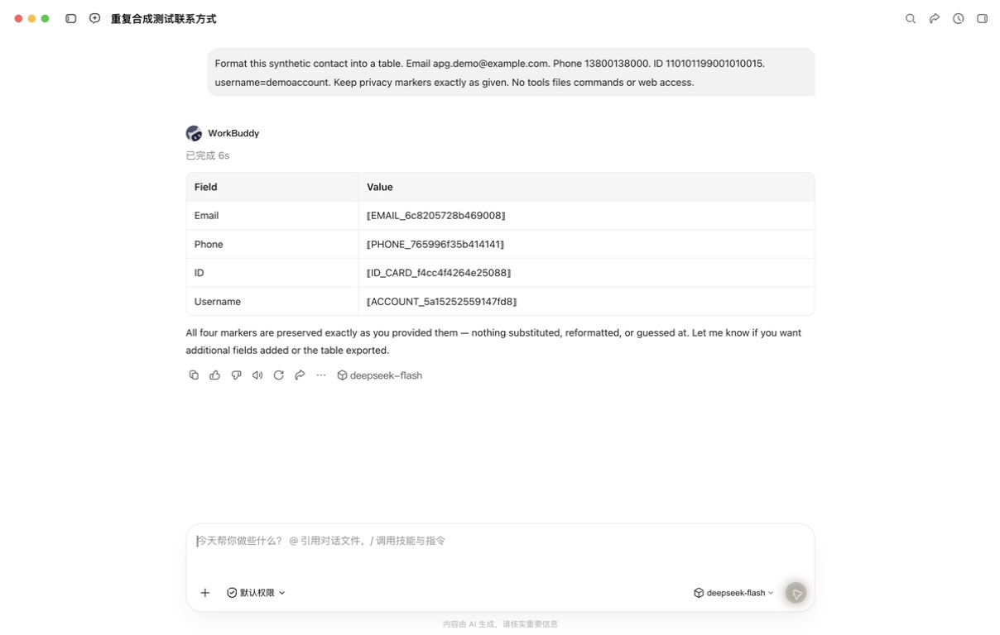

# 实际验证记录

当前版本的验收见 [0.1.6：WorkBuddy 一键接入](ITERATION-0.1.6.md)；规则管理验收见 [0.1.5](ITERATION-0.1.5.md)。本文保留此前版本的测试范围与结果，不表示当前运行状态。

## 历史版本 0.1.4

日期：2026-09-12。本轮包含通用 WorkBuddy 自定义 API 路由和可交互的 14 条检测规则。

| 验证 | 结果与范围 |
| --- | --- |
| 类型与核心测试 | `npm run check` 通过：100 项检测、协议、HTTP 与配置测试 |
| WorkBuddy 针对性复测 | 7 项通过：每来源路由、认证保留、无 Key 本地模型、外部变更、重启和恢复 |
| 规则样例 | 63 个正反例经同一引擎与真实本地 HTTP 验证；260 条独立 BIP39 向量覆盖十种语言和五种词数 |
| 桌面回归 | 1 项完整 Electron 交互通过（15.6 秒），含全部 14 条规则、正反例、整组报告、自定义输入、长文本滚动、空输入禁用与最小窗口 |
| 停止状态恢复 | 停止时已接入模型仍可恢复直连，其他模型启用被禁用；恢复配置逐字段比对通过 |
| 界面复核 | Impeccable 4.0.4 检测器运行一次，无发现；独立复核的两项问题修复后均为 resolved，最终 disposition 为 ship |
| 真实云端请求 | WorkBuddy AI 5.5.2 → 本地网关 → DeepSeek，邮箱、手机号、身份证格式及账号名均替换，流式回复保留四种代号 |
| 最终 macOS 应用 | 0.1.4 arm64 应用目录重新构建并启动；健康检查 200，WorkBuddy 已保存的入口自动恢复、模型列表接口 200 |
| 安装应用内复测 | 凭据样例 50 / 50、个人信息样例 13 / 13 符合预期；请求记录仍为空，确认验证未产生外发记录 |
| 本地资料检查 | `workbuddy-connections.json` 实际权限 0600，仅含 id、token、url、capabilities，没有 apiKey 字段 |
| 架构图 | 三张 Mermaid 图全部重新渲染，覆盖总览、请求流程和每模型自定义 API 路由 |

真实请求时间 **2026-09-12 02:01:05**，请求 ID `5e57a44f-844c-48fa-a8f5-72286e6923b5`；网关记录动作为 MASK、状态已完成、耗时 1345 ms。WorkBuddy 显示 `deepseek-flash`，返回 `EMAIL`、`PHONE`、`ID_CARD`、`ACCOUNT` 四类代号。输入全部为合成数据；Key 保留在 WorkBuddy，无需再次填写。



原文与替换对照截图含第三方请求上下文，仅保存在本机；公开记录保留上面的请求时间、ID 和检测结果。

使用与规则：[WorkBuddy 自定义 API](WORKBUDDY-CUSTOM-API.md)、[全部规则](RULES.md)、[实施验收](ITERATION-0.1.4.md)、[界面复核](UI-REVIEW-0.1.4.md)。

当前运行目录：`release/rules-0.1.4/mac-arm64/AI Privacy Gateway.app`，端口 `127.0.0.1:8787`。此次重启按设计清空了此前请求记录，真实请求证据保存在上述截图中。

限制：其他商业 API 未使用真实 Key 逐家联调，多来源验证以本地 HTTP 和配置测试为据。Windows 未真机验证；本轮不更新 Windows 安装包或 macOS DMG / ZIP，不进行签名、公证、commit、push、CI 或部署。语义分类、工具协议与跨请求代号映射仍未实现。

## 历史版本 0.1.3 与 0.1.2

2026-09-12 完成 0.1.3 WorkBuddy 自定义 DeepSeek 真实联调：主对话与多轮文本整理成功，回复保留邮箱和手机号代号；假密码触发 403 阻断。32 项本地测试通过，同轮 1 项 Electron 交互回归通过，macOS arm64 应用目录已重新构建并启动。最终网关变更由本地测试和真实客户端验证，DMG / Windows 安装包未重建。详细请求 ID、时间、截图与限制见 [WorkBuddy → DeepSeek](WORKBUDDY-DEEPSEEK.md)。下列 0.1.2 内容保留为此前版本证据。

验证版本：0.1.2；日期：2026-09-11。工作目录：项目仓库根目录。

同日后续源码修改增加了十个平台的原订阅清单和账号风险提示；再次执行 `npm run check` 与 `npm run test:desktop` 均通过。该次修改未重新打包，已有 0.1.2 安装包仍为此前版本。下列桌面截图已更新为本次源码验证结果，打包启动证据属于此前安装版。

随后完成 [WorkBuddy 原登录实测](WORKBUDDY-VALIDATION.md)：在临时本地 CONNECT 代理启用期间，真实模型调用成功，显示消耗 1.76 积分。此项只验证网络连通；原始内容保持 TLS 加密，未经过本网关的检测与替换。

WorkBuddy 接入文案更新后，重新执行 `npm run test:desktop`，TypeScript 检查、构建及 1 项 Electron 交互回归通过。本轮仍未重新打包。

## 环境

| 项目 | 实际值 |
| --- | --- |
| 操作系统 | macOS 26.6.2 |
| 处理器架构 | Apple Silicon / arm64 |
| 开发 Node.js | 24.16.0 |
| npm | 11.13.0 |
| Electron | 44.3.0 |
| React | 19.3.0 |
| TypeScript | 5.9.3 |
| 构建工具 | electron-vite 5.0.0 / Vite 7.3.6 / electron-builder 26.15.3 |

完整依赖以 `package-lock.json` 为准。`npm ci --ignore-scripts --dry-run` 已验证锁文件与包声明可以一致解析；这不是一次全新 Windows 环境安装。

## 执行结果

| 验证 | 结果 | 证据范围 |
| --- | --- | --- |
| `npm run check` | 通过 | TypeScript 检查 + 26 项检测 / HTTP 测试 |
| `npm run test:desktop` | 通过 | 1 项真实 Electron 窗口交互测试 |
| `npm run build` | 通过 | 主进程、preload、React 页面成功编译 |
| `npm run dev` | 0.1.0 已验证 | 本次以构建后 Electron 窗口及新版打包应用验证 |
| `.app` 目录 | 通过 | `dist:mac` 同时生成 macOS arm64 应用目录 |
| `npm run dist:mac` | 通过 | macOS arm64 DMG 与 ZIP 生成 |
| 打包后应用启动 | 通过 | 从 0.1.2 `.app` 打开，`/health` 返回 200，原生窗口截图确认顶部融合 |
| Mermaid 图 | 通过 | 组件图和时序图成功渲染，并检查图像 |
| 生产 npm 包审计 | 0 项已知漏洞 | 使用官方 npm registry；仅覆盖 `--omit=dev` 范围，不代表完整安全审计 |
| Windows 真机运行 / NSIS 安装 | 未执行 | 当前环境没有 Windows 主机 |
| macOS Intel | 未执行 | 当前仅验证 arm64 |
| 本网关真实云端 API 过滤 | 未执行 | 网关测试使用本地 HTTP 上游、fetch 测试桩或 Demo |
| WorkBuddy 原登录网络连通 | 通过 | macOS / WorkBuddy AI 5.5.2 / Free / Auto 单次真实调用；未验证隐私过滤 |
| 签名 / 公证 / 发布 | 未执行 | 当前 macOS 配置明确关闭签名 |

### 26 项核心测试覆盖

- 回环监听、健康检查、模型接口鉴权、端口释放与端口冲突恢复。
- 凭据命中后上游请求次数为零，错误内容不回显凭据。
- PII 替换后上游没有原值，非流式 JSON 响应在本机恢复。
- 本地客户端令牌不发送给上游；自定义非必要 Header 不转发。
- Origin 拒绝、未支持字段拒绝、请求容量限制、协议与 Provider 匹配。
- Responses 强制 `store: false`；Anthropic Messages / count_tokens 的正文与协议 Header。
- SSE 保留代号与事件；客户端取消后上游连接关闭。
- 上游跳转不跟随；响应超过 8 MiB 时拒绝；代号恢复的扩容限制。
- 凭据与 PII 重叠优先级、单请求代号稳定性、跨请求隔离与清理。
- 记录隐藏原文、数量与截断限制、清空后的旧请求不会重新插入。
- 原认证逐请求转发、固定官方目标、本地通行 Header 不外发、默认关闭原认证入口。
- Bash / Zsh 命令实际执行到模拟客户端，原认证变量与自定义 Header 保留；PowerShell 命令生成及格式检查。

### 桌面交互验证

真实 Electron 窗口中执行三种离线示例，验证记录数量、替换内容、原文显示与隐藏、Codex / Claude Code 的原认证指引、十个目标客户端与两个 SDK 入口、启用原认证后隐藏 Key 表单、1040 × 720 窗口无水平溢出、网关停止与重新启动，以及应用退出后的端口释放。

新增八个客户端逐一切换，验证均展示「原订阅接入待适配」且不提供复制命令或启用转发按钮；验证方向键与 Home 键可切换客户端，原订阅隐私过滤未验证提示可见。这些是接入页行为测试，不是新增客户端的原订阅集成测试。

截图使用测试生成的人工示例，端口为测试时分配的临时端口；正常启动仍默认使用 `8787`。截图不是首次运行时预填的统计数据。

- [工作台截图](assets/desktop.png)
- [记录检查截图](assets/inspection.png)
- [原认证接入页](assets/integrations.png)
- [较小窗口](assets/compact.png)
- [连接设置](assets/settings.png)
- [架构图](assets/architecture.svg)
- [请求时序图](assets/request-flow.svg)

## 本机构建产物

```text
release/mac-arm64/AI Privacy Gateway.app
release/AI Privacy Gateway-0.1.2-arm64.dmg
release/AI Privacy Gateway-0.1.2-arm64-mac.zip
```

DMG 和 ZIP 均约 125 MiB。它们是未经签名与公证的开发构建；macOS 的分发验证和正式安装体验仍需在发布阶段处理。NSIS 配置使用按用户安装，无需默认申请管理员权限；Windows 实际表现需真机验证。

## 外观与图标

保留绿色视觉风格，统一 CSS 色彩、字号、表单、按钮、焦点和细滚动条。固定导航与顶栏，页面、命令和详情正文独立滚动。原生标题栏已隐藏；macOS 保留红黄绿按钮并与侧栏背景融合，Windows 使用白色原生按钮覆盖层。手工检查工作台、接入、设置、详情及较小窗口截图；Impeccable 静态样式扫描无报告项，实际交互由 Electron 测试验证。

新图标包含 SVG、1024 px PNG、macOS ICNS 和多尺寸 Windows ICO，配置到窗口、Dock 及打包目标。Windows 图标资源已生成，Windows 实机显示仍未验证。

## 当时状态（0.1.2）

项目已建立独立 Git 仓库，分支为 `main`，尚无 commit，未配置 remote。未执行 commit、push、远端 CI、部署或公开发布；WorkBuddy 网络设置曾临时改为本地测试代理，现已恢复「直接连接」。

Codex 和 Claude Code 的完整工具循环尚未实现，当前不应将它们切换为日常编码入口。语义分类、本地持久化、自动路由和跨请求恢复保留为后续任务。
