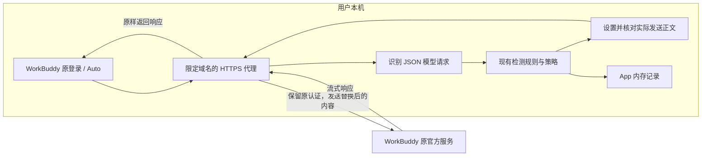

# WorkBuddy 原生 HTTPS 过滤验收与下一步

> 本文保留 0.1.4 实验记录。当前版本已经提供 [一键接入](USAGE.md)，最新验收见 [0.1.6 记录](ITERATION-0.1.6.md)。

验收日期：2026-09-12（Asia/Shanghai） · 源码版本：0.1.4 · 实验构建：`release/native-https-test`

## 1. 当前结论

**WorkBuddy 沿用原登录、内置 Auto 模型，经过本地 HTTPS 代理完成了真实文本替换和普通工作请求。** 没有新增 API Key，没有切换到自定义 DeepSeek。当前账号显示为 Free，因此本次证明的是原账号与原积分使用方式保留，不是付费会员、ChatGPT 订阅或其他客户端的验收。

本阶段的 5 项完成标准均已通过限定范围的实测。该结果只覆盖本机 WorkBuddy 原账号、Auto 模型的文本请求，不代表完整 Agent、付费会员或所有客户端均已支持。

| 完成标准 | 结果与证据 |
| --- | --- |
| 原登录能够连接 | 已验证。WorkBuddy AI 5.5.2 接受测试证书，原登录保持有效，无需新增 API Key |
| 替换发生在实际发送正文 | 已验证。4 条原生模型请求在设置最终 UTF-8 正文后核对字段替换、命中原文残留与 SHA-256 |
| 原服务、模型与权益归属 | 已验证限定范围。目的地为 `www.workbuddy.ai`，界面为 Auto，请求为 `default-model`；原 Free 账号显示积分消耗 |
| App 记录可以核对 | 已验证。4 条真实记录均完成，展示原文、替换内容、时间、动作、规则及发送正文摘要 |
| 停用并恢复 | 已验证。WorkBuddy 已改回直接连接；App 停止后两处监听端口释放；测试证书、信任与私钥均移除；正常重启后 Auto 模型完成直连回复 |

## 2. 已验证的实现



实验入口只解密 `www.workbuddy.ai:443`。本次原生模型请求为 `POST /v2/chat/completions`，其中包含客户端附加的系统上下文与工具声明。模型仍由 WorkBuddy 选择，登录与续期仍由 WorkBuddy 管理。

代理与 App 的检查入口都只监听本机回环地址；内部检查接口使用临时随机凭据，拒绝浏览器来源。认证 Header 在代理内存中比较并沿用，不交给记录界面，不保存到报告。最终正文中的已命中原文有残留、替换字段不一致或认证发生变化时，请求在本机失败。

原文预览和记录保留在 App 的有界内存中；字段预览优先展示发生替换的内容，长内容可能截断。实际发送核对针对完整解析后的 JSON 字符串值，不以界面预览或模型回显作为证明。此检查只能证明本次检测命中的值已被移除，不能证明所有敏感内容均被识别。

## 3. 真实请求证据

测试使用合成联系方式 `apg.native@example.com` 和 `13800138000`，命中「邮箱」「中国大陆手机号」，处理动作为 MASK。下表为 App 中逐条核对的证据；所有记录均显示认证保持不变、命中原文已移除、原官方服务返回成功。

| 时间 | 实际正文大小 | 持续时间 | 请求 ID |
| --- | ---: | ---: | --- |
| 12:28:13 | 2,599 字节 | 1,300 ms | `128a81ee-4686-4a54-bbca-8eb874023dd4` |
| 12:28:14 | 129,816 字节 | 5,028 ms | `ffa2474e-b65a-45e7-b016-00bc63203349` |
| 12:32:11 | 2,599 字节 | 1,201 ms | `5d1f0f7c-ffda-4588-940a-9db56e598816` |
| 12:32:12 | 129,816 字节 | 2,647 ms | `d1e58be7-a74a-4eb8-877f-2ee83ff68475` |

对应最终发送正文的 SHA-256，顺序与上表一致：

```text
90c304cae769b17445a8e5c4daec2838b6e078da1dfc45786fe3cccbe0885466
95121711c224996fb9896c190548ecf56c2072d8a025c5c7e220a9dd2c775f75
8eb14a9463ee4e7c6e13e21d3efc61558b0b13c0986e9d656c94f436f24f5456
979a4d74157011d915e5bab72c64b700e871ec1327b6547619dcd1f8f675d04e
```

两次任务分别产生两条模型请求，不能据此将请求数等同于用户任务数。带实验标记的联系方式格式化任务虽然完成了网络请求和隐私替换，但模型拒绝了内容；随后使用普通会议确认请求，模型在 9 秒内完成有效回复。这说明替换可用性仍需评测，网络成功不等于任务成功。

原账号的积分余额从 332.68 变为 328.36。界面显示连通探测、格式化任务和会议回复分别消耗 1.76、1.81、0.65 积分，合计 4.22；余额变化为 4.32，差额 0.10 尚未对账。本次可以确认原账号发生了积分消耗，不能据此声称完整计费核对通过。

## 4. 运行与恢复边界

实验使用独立 Python 3.12 环境与 mitmproxy 12.2.3。App 通过显式的 `APG_HTTPS_RUNTIME` 和 `APG_HTTPS_CA_DIR` 加载本机实验运行时，不自动安装证书、不自动更改 WorkBuddy 网络配置。目前没有面向普通用户的一键安装、证书管理或崩溃恢复流程。

测试证书仅安装到当前用户登录钥匙串，并将 SSL 信任限定为 `www.workbuddy.ai`；未修改全局系统代理。WorkBuddy 进程还临时使用了启动环境中的附加 CA。客户端的代理检测会缓存钥匙串证书，需要重启后重新载入；只设置附加 CA 没有完成本次客户端兼容。

恢复已经按以下顺序执行并核对：

1. WorkBuddy 网络恢复为「直接连接」：已完成。
2. 从 App 停止网关，确认 `8787`、`18788` 均无监听：已完成。
3. 移除本次测试根证书的用户信任和钥匙串条目：已完成。系统授权后的移除命令返回成功；证书查询确认条目不存在，用户信任设置中没有该测试证书，原测试站点证书已不能通过系统验证。
4. 删除本次测试 CA 私钥，重新启动 WorkBuddy，确保不携带测试附加 CA：已完成。只删除与已核对指纹相符的本次 CA 目录；原测试启动进程已退出，从系统正常启动 WorkBuddy。主进程不再携带附加 CA；客户端自行生成的运行时证书集合也核对过，不含本次测试根证书。未通过关闭 TLS 验证实现连接。
5. 在代理已关闭的情况下，用原 Auto 模型完成一次不含敏感信息的直连请求：已完成。13:21 的「请求回复特定字符串」任务在 9 秒内返回 `APGDIRECTRESTORED`，显示 Auto、消耗 1.84 积分；本地两处网关端口继续关闭，网关记录仍为先前 4 条。

恢复后 WorkBuddy 保持直接连接，网关 App 保持停止并保留 4 条内存验收记录；关闭 App 后记录清空。未创建 WorkBuddy 自身的 `ca.pem` 文件，也未更改原有自定义模型来源或登录凭据。本次测试证书已移除，重新启用原生 HTTPS 实验仍需要重新进行证书与客户端接入设置。

## 5. 验证结果与限制

本次重新运行类型检查和 104 项常规测试，全部通过；另有 3 项原生代理测试通过，覆盖压缩正文、实际本地检查接口、认证与工具结构保持、阻断、运行时不存在、端口冲突和停用后的进程结束。macOS 实验应用已构建并启动，真实窗口与请求记录已经核对。没有执行 commit、push、CI 或部署。

本次未验证 Windows、其他客户端、付费会员、认证续期、长时间运行或完整工具循环。已识别的 JSON 模型请求之外，其他接口保持原行为；图片、音频和文件类型内容不纳入本次成功范围。多轮映射、流式代号恢复与工具执行语义仍未交付。安装信任证书解决的是能够读取 HTTPS 内容的一个前提，协议字段与客户端行为仍需适配。单次成功也不能作为账号长期安全或免封保证。

## 6. 下一阶段目标

**让 WorkBuddy 原生模型完成一个多轮、读文件、调用工具的受保护任务，并保持任务可用。** 原客户端、原登录、原模型和原积分方式继续保留。先在隔离的合成测试目录验收，再扩展客户端数量。

| 优先级 | 需要交付的行为 | 验收方式 |
| --- | --- | --- |
| P1 | 用户能够自行启用、诊断和停用 | App 展示证书、客户端接入与真实检查状态；停用恢复原配置；异常退出后有明确恢复方法 |
| P1 | 多轮、文件上下文与工具结果获得检查 | 合成文件含测试 PII；后续请求和工具结果中，已命中原文不外发；工具仍能读取预期文件并完成任务 |
| P1 | 同一实体跨轮保持一致，必要位置能够恢复 | 验证会话隔离、流式分片、工具参数和取消请求，不将代号误当成本地真实路径或执行参数 |
| P2 | 原生 Codex 订阅的独立验收 | 保留 ChatGPT 登录、原模型和原额度，按同样标准做真实任务测试；不能由 WorkBuddy 成功直接推定 |
| P2 | Windows 与其他客户端扩展 | 每个平台确认实际请求、认证、原权益、任务质量和恢复；再将状态标为已支持 |

原来的 Secret、PII、语义分类、可逆替换、策略、路由、开源发布与企业能力仍保留在完整路线图中。此处调整先后顺序，不将尚未实现的需求删除；历史差距清单见 `ROADMAP-REVIEW.md`。
