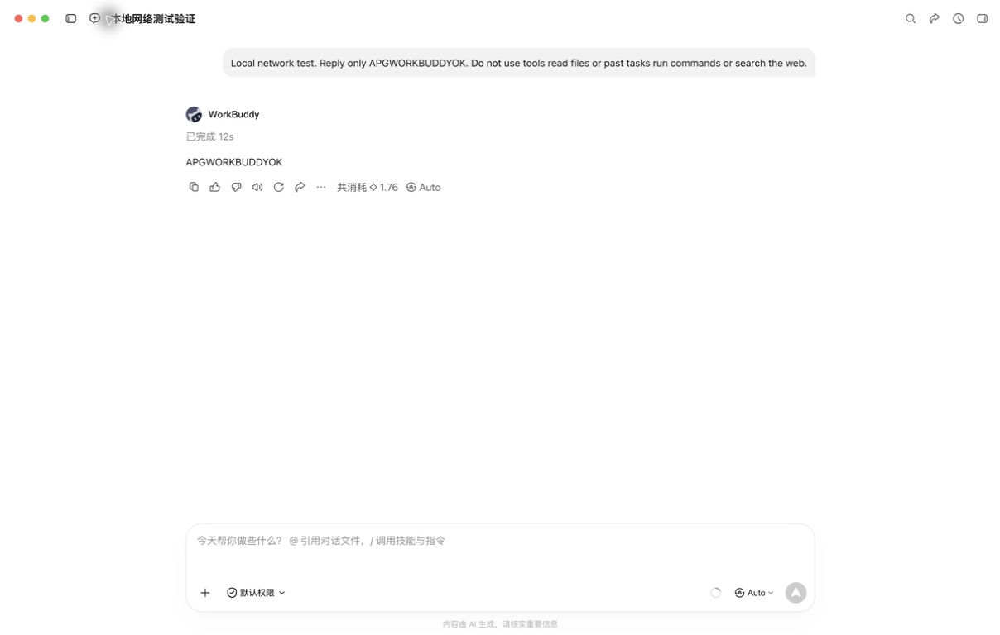

# WorkBuddy 原登录联调记录

测试日期：2026-09-11，23:07–23:13（Asia/Shanghai）。

## 结论

WorkBuddy AI 在启用临时本地网络代理后，沿用现有登录完成了一次真实模型调用，无需重新填写 API Key。**隐私过滤尚未接入。** 此次网络代理只转发 TLS 加密连接，无法读取、替换或阻断其中的敏感内容。

这次结果只覆盖本机 WorkBuddy AI 5.5.2 的 Free 账户和 Auto 模式。付费会员、其他版本、Windows、工具循环及全部出站请求覆盖范围均未验证。一次成功调用不能证明账号以后不会被限制。

## 测试条件与结果

| 项目 | 实际结果 |
| --- | --- |
| 客户端 | `/Applications/WorkBuddy AI.app`，版本 5.5.2，应用标识 `com.workbuddy.workbuddy-ai` |
| 产品归属 | 腾讯 WorkBuddy AI，应用自带官网为 `https://www.workbuddy.ai/`；不能与国内版直接等同 |
| 环境 | macOS 26.6.2 / Apple Silicon |
| 登录与模型 | 保留现有 Free 登录，模型为 Auto；没有添加独立 API 凭据 |
| 测试空间 | 新建空白空间 `APG WorkBuddy Test 2026-09-11` |
| 测试任务 | 「本地网络测试验证」，保留在 WorkBuddy 内供复核 |
| 设置入口 | 设置 → 通用 → 网络代理 → 手动配置 |
| 临时代理 | `http://127.0.0.1:18788`，只处理 HTTPS CONNECT，未实现 TLS 解密 |
| 真实调用 | 界面显示完成，耗时 12 秒，回复 `APGWORKBUDDYOK` |
| 额度 | 该次回复下方显示消耗 1.76 积分；未据此推断付费会员计费规则 |
| 恢复 | 已切回测试前的「直接连接」，关闭临时代理，确认 18788 端口不再监听 |

实际发送的内容：

```text
Local network test. Reply only APGWORKBUDDYOK. Do not use tools read files or past tasks run commands or search the web.
```

测试回复未展示工具调用。任务启动时客户端仍会自动连接自身 MCP 服务，因此这不是禁用客户端所有后台活动的证明。



## 网络证据及其边界

临时代理只记录时间、目标主机和端口、连接状态、双向字节数，以及首个数据块是否具有 TLS ClientHello 特征。没有记录请求头、Cookie、Token、HTTP 路径或正文，没有安装证书或修改 TLS 校验。

排除对 `example.com` 的代理自检后，测试期间观察到 70 条 CONNECT 连接，其中 38 条目标为 `www.workbuddy.ai:443`；70 条均观察到 TLS 握手特征。其余连接包括客户端后台服务。**连接数量不等于模型调用次数。** 记录覆盖代理启用至关闭的整个窗口，不能将全部流量归因于那一次测试任务。

原登录调用成功与连接记录共同证明：客户端在启用本地网络代理的状态下仍可正常调用模型，并有流量经过代理。由于未解密，无法逐条确认模型 HTTP 请求路径，也没有证明所有主模型、辅助模型、插件或后台流量都经过代理。

当前 Privacy Gateway 的 `127.0.0.1:8787` 健康检查正常，模式为 `demo`。向该端口发送不带认证和正文的本地 CONNECT 探测后，连接关闭，未返回建立隧道所需的成功响应。该端口提供 OpenAI / Anthropic 格式的 HTTP API，不是 WorkBuddy 设置所需的 HTTPS 正向代理。

```text
本次实际测试：
WorkBuddy 原登录
  → 本机 CONNECT 探测代理 :18788
  → 原服务（TLS 加密保持完整）
  → 成功回复；未执行隐私检测

尚未实现：
WorkBuddy 完整模型请求
  → 本机明文检测、策略处理及替换
  → 原服务
```

## 下一步适配条件

应先核验平台支持的完整请求拦截接口、插件接口或可保留原认证的模型地址配置；读取单次用户输入的 Hook 不能覆盖之后附加的代码、记忆和工具结果。安装包中出现端点环境变量，并不证明内置会员模型实际遵循这些变量。

具备明文入口后，还需要验证请求和响应协议、工具参数、签名、流式返回、取消、会话恢复和原额度归属。只有这些验证与真实过滤记录同时成立，才可把状态改为「隐私网关已支持」。

本次未部署 HTTPS 解密代理。这样的方案会改变证书信任及凭据可见范围，需要单独设计和明确授权，不能作为普通网络代理的隐含操作。

## 交付状态

接入页已更新为「连通已测 · 未脱敏」，仍不提供 WorkBuddy 启用命令。临时探测脚本和仅含连接元数据的原始记录留在项目忽略目录 `work/`，不进入产品构建；测试截图不包含账号标识。

本轮更新源码与文档，不重新打包安装程序。未执行 commit、push 或发布。

接入页文案更新后执行 `npm run test:desktop`：TypeScript 检查、应用构建及 1 项 Electron 交互回归均通过。该回归使用本地演示数据，与上面的 WorkBuddy 真实调用分别记录。
